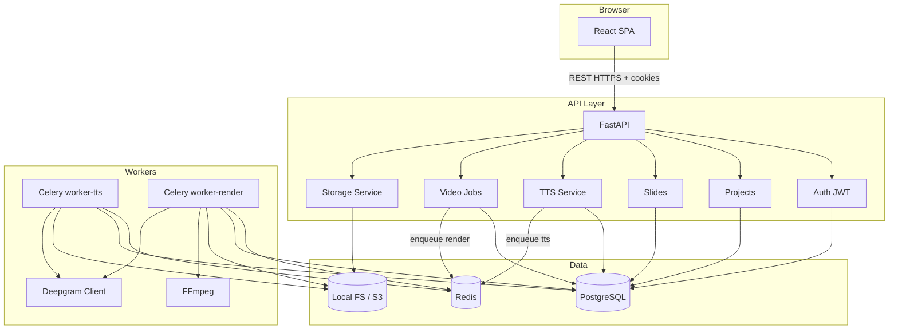
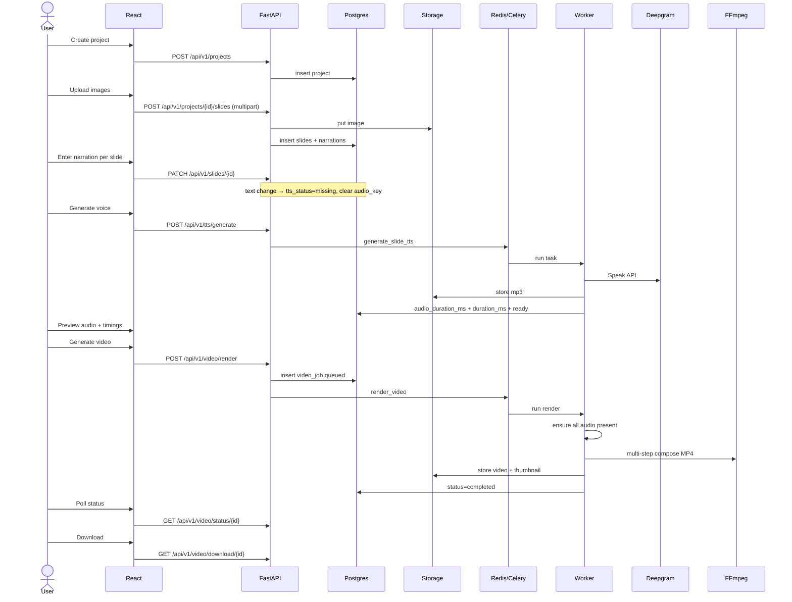
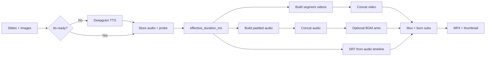

# AI Learning Video Generator — System Design Document

| Field | Value |
|-------|--------|
| **Document Title** | AI Learning Video Generator — MVP Architecture & Implementation Design |
| **Author** | TBD |
| **Date** | 2026-07-16 |
| **Status** | Draft |
| **Version** | 1.2 (post re-review residual fixes) |
| **Repository** | `/Users/mac-07/Documents/GitHub/video-creator` (greenfield) |
| **Audience** | Senior engineers implementing MVP |

---

## Overview

The AI Learning Video Generator converts learning content—uploaded slide images plus per-slide narration scripts—into professional educational MP4 videos. Users create a project, upload and order images, write narration, generate speech via Deepgram TTS, preview timings, then render a synchronized video (Ken Burns zoom, per-segment fade, optional subtitles and background music) through a background worker using FFmpeg.

This document defines an **implementation-ready MVP architecture** for a greenfield monorepo: React + TypeScript frontend, FastAPI backend, PostgreSQL, Redis + Celery workers, local filesystem storage (S3-compatible path for production), and Docker Compose for local development. MVP is deliberately scoped to a linear create → upload → narrate → TTS → render → download flow. Future AI features (script generation, avatars, multi-aspect export) are noted for extensibility only.

---

## Background & Motivation

### Problem

Educators and content creators spend hours manually assembling slide decks, recording voiceovers, aligning audio to visuals, and exporting video in tools like Camtasia, Premiere, or PowerPoint + screen record. The process is error-prone, hard to re-voice, and poorly suited for iterative curriculum updates.

### Opportunity

Automating TTS narration, duration calculation from audio, and FFmpeg composition reduces that workflow to: upload slides → write (or later AI-generate) scripts → pick a voice → render. Deepgram’s Aura TTS provides low-latency, natural speech; FFmpeg handles deterministic video composition without GPU requirements for MVP.

### Current state

The repository is **empty**. There is no legacy schema, auth, or deployment constraint. This design establishes conventions from day one: monorepo layout, typed API contracts, job-based rendering, and production-shaped infrastructure (Postgres + Redis + workers) even for MVP.

### Pain points the MVP addresses

| Pain point | MVP approach |
|------------|--------------|
| Manual voice recording | Deepgram TTS per slide |
| Audio/video sync | Duration derived from generated audio length; **concat timeline** (equal A/V segment lengths) |
| Multi-tool export pipeline | Multi-step FFmpeg composition job |
| Re-render after script edit | Invalidate TTS on text/voice/speed change; re-queue render as **new job** |
| Opaque long-running work | Job status API + polling (WebSocket later) |

---

## Goals & Non-Goals

### Goals (MVP / v1)

1. Authenticated users can create projects, upload images, order slides, and attach narration text.
2. Generate and store per-slide audio via Deepgram TTS (selectable voice, speed) **asynchronously via Celery**.
3. Preview slide list with image, narration text, audio playback, and computed durations.
4. Enqueue video render jobs; workers produce H.264 MP4 with Ken Burns, per-segment fade + concat, audio sync, optional subtitles and BGM.
5. Poll job status; download completed MP4.
6. Local Docker Compose stack: API, **worker-tts**, **worker-render**, Redis, Postgres, FFmpeg available to workers.
7. Secure uploads (MIME/extension validation, size limits) and **signed media URLs** for ``/`<audio>`/`<video>`.
8. Clear PR-sized implementation path from empty repo to working MVP.

### Non-Goals (explicitly out of MVP)

- AI script generation from bullets, AI images, AI music, avatars, quizzes, chapters.
- Multi-language localization UI (TTS multi-language voices may exist but are not a product feature yet).
- Social export (YouTube Shorts/Reels templates, 9:16 presets as first-class product).
- Collaborative real-time editing, comments, teams/orgs RBAC.
- CDN edge delivery, multi-region, auto-scaling render farms.
- Mobile native apps.
- Payment/billing.
- WebSocket / SSE push (polling is sufficient for MVP).
- MoviePy/OpenCV as primary render path (optional helpers only; FFmpeg is source of truth).
- Crossfade (`xfade`) transitions that shorten the timeline (deferred to v1.1 with matched audio `acrossfade`).
- Managed cloud encoders (AWS MediaConvert, etc.).

### Phase boundaries

| Phase | Scope |
|-------|--------|
| **MVP (this doc)** | Auth, projects, slides, TTS, Celery render (concat+fade), download, local storage, signed media URLs |
| **v1.1** | `xfade` transitions with matched A/V, BGM polish, richer transitions, thumbnail UX |
| **v1.2** | S3 storage, production deploy, status WebSockets/SSE, usage quotas |
| **v2** | AI narration assist, auto-timing UX, multi-aspect export, multi-language |

---

## Key Decisions

| # | Decision | Choice | Rationale |
|---|----------|--------|-----------|
| 1 | Repo structure | Monorepo: `backend/`, `frontend/`, `docker/`, `docs/` | Single clone for greenfield; shared compose and versioning; simple CI |
| 2 | API framework | FastAPI + Pydantic v2 + SQLAlchemy 2.x + Alembic | Async-friendly HTTP, typed contracts, mature ORM migrations |
| 3 | Database | **PostgreSQL 16** | Production-shaped MVP; JSONB for job metadata; concurrent workers need real locking semantics |
| 4 | Task queue | **Celery + Redis** | Long-running FFmpeg (minutes); retries/acks; multi-queue routing; broader ops knowledge than Dramatiq; richer than RQ for timeouts |
| 5 | Object storage (MVP) | **Local filesystem** mounted volume; abstraction `StorageBackend` | Zero cloud cost for local dev; same interface later maps to S3 |
| 6 | Object storage (prod path) | S3-compatible (AWS S3 / MinIO) behind same interface | Design storage keys now so migration is config-only |
| 7 | Auth (MVP) | Email + password (**bcrypt** only); **access JWT in memory (Bearer)**; **refresh JWT in httpOnly cookie** (`SameSite=Lax`); **`Secure` only when HTTPS / non-development** | Access not in localStorage (XSS); cookie refresh enables silent renew; CORS `credentials: true`; plain HTTP local Compose must not set `Secure` |
| 8 | TTS provider | Deepgram Aura TTS (`/v1/speak`) with `speed` query param | Per product requirement; file-based audio for FFmpeg |
| 9 | Video engine | **FFmpeg CLI** via `subprocess` list args (`shell=False`) | Deterministic filters; avoid MoviePy opacity in production |
| 10 | Frontend stack | React 18 + TS + Vite + MUI + React Query + dnd-kit + React Player | Matches draft; dnd-kit over react-dnd for modern DnD |
| 11 | API style | REST + JSON; job **polling** | Simple; OpenAPI from FastAPI for frontend types |
| 12 | Render model | One Celery task per video job; inline missing-TTS then compose | Easier failure recovery; partial TTS success is idempotent |
| 13 | Slide duration | `effective_duration_ms = coalesce(audio_duration_ms, duration_ms, 5000)` | Single formula for preview, readiness estimate, and FFmpeg |
| 14 | Subtitles (MVP) | Optional SRT from **final audio timeline**; burned-in | Cues align with spoken audio under concat model |
| 15 | Max scale (MVP targets) | ≤50 slides/project, ≤10 MB/image, ≤1080p, ≤20 min video | Keeps worker memory and FFmpeg graphs bounded |
| 16 | A/V timeline (MVP) | **Concat model**: per-segment fade in/out + concat demuxer; segment length = effective duration | Eliminates xfade/audio length mismatch; `xfade` deferred to v1.1 |
| 17 | TTS execution | **Always async** (Celery `tts` queue); never inline in API request | Consistent UX, timeouts, retries; FE polls status |
| 18 | Render history | Keep last **3 completed** jobs per project; delete older artifacts on new success | Bounds storage; export UI can pick recent version |
| 19 | Transition duration | **Global fixed 500 ms** fade in/out on segments; per-slide `transition` is enum `none \| fade` only (no per-slide duration field) | Removes ambiguity; simple concat math |
| 20 | Email verification | **Not required** for MVP demo | Open register/login; add verification in v1.2 if public |
| 21 | Media serving | **HMAC signed query tokens** (TTL 10 min) for GET files | ``/`<audio>`/`<video>` cannot send Bearer headers |
| 22 | Job cancel | **No cancel in MVP**; public statuses are `queued \| processing \| completed \| failed` only | Avoid half-implemented revoke; user starts a new render instead |
| 23 | BGM | Asset id after multipart upload; **never client URL** | SSRF prevention; same validation path as images |
| 24 | Narration schema | Separate **1:1 `narrations` table** (not columns on slides) | Clear TTS status machine; optional future multi-take without slide row churn |

### Celery vs RQ vs Dramatiq (justification)

| Criterion | Celery | RQ | Dramatiq |
|-----------|--------|-----|----------|
| Long tasks / soft-hard time limits | Excellent | Basic | Good |
| Retries, exponential backoff | Built-in | Manual-ish | Built-in |
| Routing multiple queues (tts vs render) | First-class | Limited | Good |
| Ecosystem / hireability | Highest | High | Medium |
| Complexity | Higher | Lowest | Medium |
| Broker | Redis/RabbitMQ | Redis only | Redis/RabbitMQ |

**Choice: Celery + Redis.** Video renders are long-running, benefit from hard time limits (30 min kill), dedicated `render` queue separate from short `tts` jobs, and structured retry policies. RQ is simpler but weak on timeouts and multi-queue ops. Dramatiq is a strong alternative but Celery’s operational familiarity wins for this greenfield MVP.

---

## Proposed Design

### High-level architecture

```text
┌──────────────────────────────────────────────────────────────────────────┐
│                          Docker Compose (local)                          │
│  ┌──────────────┐   ┌──────────────┐   ┌─────────┐   ┌──────────────┐   │
│  │  frontend    │   │  api         │   │ redis   │   │  postgres    │   │
│  │  Vite/React  │──▶│  FastAPI     │──▶│ broker  │   │  16          │   │
│  └──────────────┘   └──────┬───────┘   └────┬────┘   └──────▲───────┘   │
│                            │                │               │           │
│                     ┌──────┴───────┬────────┴────────┐      │           │
│                     ▼              ▼                 ▼      │           │
│              ┌────────────┐ ┌─────────────┐  ┌────────────┐ │           │
│              │ worker-tts │ │worker-render│  │ (both use  │─┘           │
│              │ Q=tts,def  │ │ Q=render    │  │  storage)  │             │
│              │ conc=4     │ │ conc=1      │  │  + ffmpeg  │             │
│              └────────────┘ └─────────────┘  └────────────┘             │
│                            │                                            │
│                            ▼                                            │
│                     uploads/{project_id}/...  (shared volume)           │
│                            │                                            │
│                            ▼                                            │
│                     Deepgram API (external HTTPS)                       │
└──────────────────────────────────────────────────────────────────────────┘
```



### Monorepo layout

```text
video-creator/
├── backend/
│   ├── app/
│   │   ├── main.py                 # FastAPI app factory + exception handlers
│   │   ├── config.py               # pydantic-settings
│   │   ├── dependencies.py         # DI: db, current_user, storage
│   │   ├── db/
│   │   │   ├── base.py
│   │   │   ├── session.py
│   │   │   └── models/             # SQLAlchemy models
│   │   ├── api/
│   │   │   ├── router.py
│   │   │   ├── auth.py
│   │   │   ├── projects.py
│   │   │   ├── slides.py
│   │   │   ├── tts.py
│   │   │   ├── video.py
│   │   │   └── files.py            # signed media GET
│   │   ├── schemas/                # Pydantic request/response
│   │   ├── services/
│   │   │   ├── auth_service.py
│   │   │   ├── project_service.py
│   │   │   ├── slide_service.py
│   │   │   ├── tts_service.py
│   │   │   ├── video_service.py
│   │   │   ├── storage.py          # StorageBackend ABC + Local + S3
│   │   │   ├── media_tokens.py     # HMAC sign/verify
│   │   │   └── ffmpeg_pipeline.py  # normative multi-step renderer
│   │   ├── workers/
│   │   │   ├── celery_app.py
│   │   │   └── tasks.py
│   │   └── utils/
│   │       ├── security.py         # bcrypt, JWT access/refresh
│   │       ├── media.py            # ffprobe duration
│   │       ├── files.py            # MIME validation
│   │       └── exceptions.py       # NonRetryableTaskError hierarchy
│   ├── alembic/
│   ├── tests/
│   ├── requirements.txt
│   ├── Dockerfile
│   └── Dockerfile.worker
├── frontend/
│   ├── src/
│   │   ├── main.tsx
│   │   ├── App.tsx
│   │   ├── api/                    # Axios (withCredentials) + React Query
│   │   ├── auth/                   # in-memory access token holder
│   │   ├── routes/
│   │   ├── pages/
│   │   ├── components/
│   │   ├── hooks/
│   │   └── theme/
│   ├── package.json
│   ├── vite.config.ts
│   └── Dockerfile
├── docker/
│   ├── docker-compose.yml
│   └── nginx.conf                  # optional local reverse proxy
├── scripts/
│   └── dev-bootstrap.sh
├── .env.example
├── README.md
└── docs/
    └── design.md
```

### Domain model & user workflow



### Component responsibilities

| Component | Responsibility |
|-----------|----------------|
| **React SPA** | Auth UI, project CRUD, slide DnD, narration forms, voice picker, preview player, render progress, download |
| **FastAPI** | Auth (Bearer + cookie refresh), validation, orchestration, enqueue jobs, signed media URLs |
| **Project Service** | Ownership checks, status transitions, cascade delete coordination, storage quota checks |
| **Slide Service** | Ordering (transactional), image replace, narration invalidation, transition/animation fields |
| **TTS Service** | Validate voice/speed, enqueue Celery TTS, store audio, set duration via ffprobe |
| **Video Service** | Create `VideoJob`, readiness validation, enqueue, status, download; retention of last 3 jobs |
| **Storage Service** | Path key generation, put/get/delete, content-type, future S3 |
| **Media Tokens** | HMAC sign/verify for query-string media access |
| **Celery Workers** | TTS and render tasks with retries, visibility timeout, stuck-job recovery |
| **FFmpeg Pipeline** | **Normative multi-step**: segments → concat → audio mix → subtitles → mux |

### Duration invariants (normative)

```text
DEFAULT_DURATION_MS = 5000

effective_duration_ms(slide) =
  coalesce(
    narration.audio_duration_ms,   # when tts_status == ready and audio present
    slide.duration_ms,             # user fallback / default after create
    DEFAULT_DURATION_MS
  )

# After successful TTS:
narration.audio_duration_ms = ffprobe_ms(audio_file)
slide.duration_ms = narration.audio_duration_ms   # keep in sync for list UI simplicity

# FFmpeg ALWAYS uses effective_duration_ms(slide) for segment length.
# Preview UI uses the same function.

# estimated_total_duration_ms (for 20 min cap) =
#   sum(effective_duration_ms(s) for s in slides)
# Under MVP concat model there is NO transition overlap subtraction.
```

**On narration text, voice, or speed change (PATCH):**

1. Update fields on `narrations`.
2. Set `tts_status = missing`.
3. Clear `audio_key`, `audio_duration_ms`, `tts_error`.
4. Do **not** clear `slide.duration_ms` (keeps last known fallback for preview until re-TTS); after re-TTS both fields update again.

**On image replace only:** TTS audio remains valid (same script).

**Force regenerate:** `POST /tts/generate` with `force: true` re-calls Deepgram even if `ready`.

### Project status transitions

| Status | Meaning | Transitions |
|--------|---------|-------------|
| `draft` | Default on create; editable | → `archived` via PATCH; remains `draft` until user archives (MVP does **not** auto-set `ready`) |
| `archived` | Hidden from default list | → `draft` via PATCH unarchive |

**Note:** MVP does **not** use a computed `ready` project status. “Ready to render” is evaluated at enqueue time by readiness rules (see Video API), not stored on the project. The `status` column values for projects are only `draft | archived`.

### Video generation pipeline (overview)

```text
1. Load project slides ordered by order_index ASC
2. For each slide with tts_status != ready (if regenerate_missing_audio):
     call Deepgram TTS; store audio; set audio_duration_ms + duration_ms
3. For each slide: d_i = effective_duration_ms(slide) / 1000.0 seconds
4. Build SRT from cumulative d_i on the **audio concat timeline**
5. Multi-step FFmpeg (ALWAYS multi-step for MVP — never single filter_complex for all slides):
     a. Per slide: image → segment_i.mp4 length exactly d_i (Ken Burns or static + fade)
     b. Concat video segments → video_silent.mp4 (total = sum d_i)
     c. Per slide: pad/trim audio to d_i; concat → narration.wav (total = sum d_i)
     d. Optional BGM amix → audio_mix.wav
     e. Mux video + audio + burn subtitles → output.mp4
6. Thumbnail; store keys; mark job completed
7. Enforce last-3 completed jobs retention for project
```



---

## Renderer algorithm (normative)

This section is **normative**. Implementations must follow it for MVP. Deviation (e.g. introducing `xfade`) requires a design update and matching audio graph.

### Constants

```python
FPS = 30
WIDTH, HEIGHT = 1920, 1080
DEFAULT_DURATION_MS = 5000
FADE_S = 0.5                    # global; only when transition == "fade"
KEN_BURNS_ZOOM_END = 1.15
MAX_VIDEO_DURATION_S = 20 * 60
RENDER_HARD_LIMIT_S = 1800
RENDER_SOFT_LIMIT_S = 1700
VISIBILITY_TIMEOUT_S = 3600     # > hard limit
STUCK_JOB_GRACE_S = 120         # started_at + hard + grace → fail
```

### Duration math

```python
def effective_duration_ms(slide, narration) -> int:
    if narration and narration.tts_status == "ready" and narration.audio_duration_ms:
        return int(narration.audio_duration_ms)
    if slide.duration_ms and slide.duration_ms > 0:
        return int(slide.duration_ms)
    return DEFAULT_DURATION_MS

def timeline(slides_with_narrations) -> list[dict]:
    """Build exclusive on-screen segments; no overlap in MVP concat model."""
    t = 0.0
    out = []
    for slide, narr in slides_with_narrations:
        d_ms = effective_duration_ms(slide, narr)
        d_s = d_ms / 1000.0
        out.append({
            "slide_id": slide.id,
            "start_s": t,
            "end_s": t + d_s,
            "duration_s": d_s,
            "duration_ms": d_ms,
            "transition": slide.transition,  # "none" | "fade"
            "animation": slide.animation,    # "none" | "ken_burns"
            "image_path": ...,
            "audio_path": narr.audio_key and resolve(...),
            "text": narr.text or "",
        })
        t += d_s
    return out  # total_s = t == sum(duration_s)
```

**Definition:** `duration_ms` / `effective_duration_ms` is **exclusive on-screen time** for that slide (start inclusive, end exclusive on the global timeline). Under the concat model, total video duration equals total audio duration equals `sum(effective_duration_ms)`.

### Video segment build (step A)

For each timeline entry `i` with duration `d` seconds, frames `n = max(1, round(d * FPS))`:

**Ken Burns** — scale zoom rate by duration so motion completes over the full segment:

```python
# zoom goes from 1.0 to KEN_BURNS_ZOOM_END over n frames
# per-frame increment: (zoom_end - 1.0) / max(n - 1, 1)
zoom_inc = (KEN_BURNS_ZOOM_END - 1.0) / max(n - 1, 1)
# zoompan z expression: min(1.0 + on*{zoom_inc}, {zoom_end})
```

```bash
# shell=False; paths absolute; example args only
ffmpeg -y -loop 1 -i /abs/slide.png \
  -vf "scale=1920:1080:force_original_aspect_ratio=decrease,\
pad=1920:1080:(ow-iw)/2:(oh-ih)/2,\
zoompan=z='min(1.0+on*{zoom_inc},{zoom_end})':x='iw/2-(iw/zoom/2)':y='ih/2-(ih/zoom/2)':d={n}:s=1920x1080:fps=30,\
fade=t=in:st=0:d={fade_in},fade=t=out:st={fade_out_start}:d={fade_out},\
format=yuv420p" \
  -t {d} -an /abs/work/segment_{i:04d}.mp4
```

Fade application when `transition == "fade"`:

- `fade_in = FADE_S` if not first segment else `0` (optional: still fade first in)
- `fade_out = FADE_S` if not last segment else `0`
- `fade_out_start = max(0, d - fade_out)`
- If `d < 2 * FADE_S`, scale fades to `d / 4` each to avoid overlap collapse

When `transition == "none"`: omit fade filters.

When `animation == "none"`: scale/pad only (no zoompan), still `-t d` and optional fades.

**Acceptance:** `ffprobe` duration of `segment_i.mp4` within **50 ms** of `d`.

### Video concat (step B)

```text
# concat_list.txt
file '/abs/work/segment_0000.mp4'
file '/abs/work/segment_0001.mp4'
...
```

```bash
ffmpeg -y -f concat -safe 0 -i /abs/work/concat_list.txt -c copy /abs/work/video_silent.mp4
```

If copy-concat fails (timestamp quirks), re-encode: `-c:v libx264 -crf 20 -preset medium`.

**Acceptance:** `|video_silent_dur - sum(d_i)| < 100 ms`.

### Audio build (step C)

For each slide:

```bash
# pad/trim to exactly d seconds
ffmpeg -y -i /abs/audio_i.mp3 -af "apad=whole_dur={d},atrim=0:{d},asetpts=PTS-STARTPTS" \
  /abs/work/audio_{i:04d}.wav
```

Concat with concat demuxer (or `concat` filter) → `narration.wav`.

**Acceptance:** `|narration_dur - sum(d_i)| < 50 ms` and `|narration_dur - video_silent_dur| < 50 ms`.

### Optional BGM (step D)

Only if `options.background_music_asset_id` resolves to a project-owned file under `music/`:

```bash
ffmpeg -y -i narration.wav -i /abs/bgm.mp3 -filter_complex "\
[1:a]volume={vol},aloop=loop=-1:size=2e+09[bg];\
[bg]atrim=0:{total_s},asetpts=PTS-STARTPTS[bg2];\
[0:a][bg2]amix=inputs=2:duration=first:dropout_transition=2[aout]" \
-map "[aout]" /abs/work/audio_mix.wav
```

Else `audio_mix.wav = narration.wav`.

### Subtitles (step E)

Build SRT from **timeline** (same starts/ends as audio concat):

```python
def build_srt(entries: list[dict]) -> str:
    # sanitize text: strip \r, replace blank lines with space, escape nothing special
    # but replace "-->" with "→"; ensure UTF-8
    ...
```

```text
1
00:00:00,000 --> 00:00:12,450
Chloroplasts capture light energy...

2
00:00:12,450 --> 00:00:25,100
Carbon dioxide enters through stomata...
```

Write `/abs/work/job.srt` UTF-8. Burn-in only (no soft subs in MVP).

### Final mux (step F)

```bash
ffmpeg -y -i /abs/work/video_silent.mp4 -i /abs/work/audio_mix.wav \
  -vf "subtitles=/abs/work/job.srt:force_style='FontName=DejaVu Sans,FontSize=24,Outline=1'" \
  -c:v libx264 -preset medium -crf 20 -c:a aac -b:a 192k \
  -movflags +faststart \
  /abs/work/output.mp4
```

If subtitles disabled, omit `-vf subtitles=...`.

**Do not use `-shortest` as a substitute for correct durations.** After mux, assert `|out_v - out_a| < 50 ms` via ffprobe; if failed, fail job with `FFMPEG_AV_MISMATCH`.

### Thumbnail

```bash
ffmpeg -y -ss 00:00:01 -i /abs/work/output.mp4 -frames:v 1 -q:v 2 /abs/work/thumb.jpg
```

### Python entrypoint

```python
# backend/app/services/ffmpeg_pipeline.py
@dataclass
class RenderOptions:
    width: int = 1920
    height: int = 1080
    fps: int = 30
    include_subtitles: bool = True
    bgm_path: Path | None = None
    bgm_volume: float = 0.15
    crf: int = 20
    # transition duration is global FADE_S; not per-request

def render_project_video(
    slides: list[SlideMedia],
    output_path: Path,
    work_dir: Path,
    options: RenderOptions,
    progress_cb: Callable[[int, str], None] | None = None,
) -> RenderResult:
    """
    ALWAYS multi-step. progress_cb at stage boundaries:
      40 segments, 55 concat_video, 70 audio, 80 mux, 90 thumb
    subprocess.run(argv: list[str], shell=False, capture_output=True, check=True)
    stderr truncated to 4KB on failure.
    """
```

### Integration test fixture (required for PR 8)

- 3 synthetic slides, fixed PNGs, fixed WAV/MP3 of known lengths (e.g. 2.0s, 3.0s, 2.5s).
- Assert `|video_dur - audio_dur| < 50 ms` and `|total - 7.5s| < 100 ms`.
- Assert SRT cue end times match cumulative durations within 50 ms.

### Deferred: xfade (v1.1 only)

If product later requires true crossfade:

1. Shorten total video by `(n-1) * fade_s`.
2. Build narration with **identical** `acrossfade` offsets — never plain audio concat.
3. SRT must use the **post-xfade** timeline, not raw sum of exclusive durations.

**MVP must not implement xfade.**

---

## API / Interface Changes

Base path: `/api/v1`.

**Authentication:**

- Protected routes: `Authorization: Bearer <access_token>`.
- Refresh: cookie `refresh_token` (httpOnly, `SameSite=Lax`, Path=/api/v1/auth) — **not** returned in JSON body for browser clients.
- **Cookie `Secure` flag (normative):**

  ```python
  # settings
  COOKIE_SECURE: bool  # default: False if APP_ENV == "development" else True
  # Or derive per-request: Secure = request.url.scheme == "https"
  ```

  | Environment | Cookie attributes (refresh) |
  |-------------|----------------------------|
  | Local Compose (`APP_ENV=development`, `http://localhost:8000`) | `HttpOnly; SameSite=Lax; Path=/api/v1/auth; Secure` **omitted** |
  | Production / any HTTPS | `HttpOnly; Secure; SameSite=Lax; Path=/api/v1/auth` |

  Browsers **will not store or send** `Secure` cookies over plain HTTP. Always setting `Secure` breaks the documented local stack. Implementers must env-gate or scheme-gate the flag.

- **Local same-origin (recommended):** Vite dev proxy `/api` → `http://api:8000` so FE and API share `localhost` origin for cookies; still set CORS credentials for non-proxied setups.
- CORS: `allow_origins=CORS_ORIGINS`, `allow_credentials=True`.
- OpenAPI is the source of truth from PR 3 onward; error handlers produce the envelope below.

### Auth

#### `POST /api/v1/auth/register`

```json
// Request
{ "email": "user@example.com", "password": "min8chars!", "display_name": "Ada" }

// Response 201
{
  "id": "uuid",
  "email": "user@example.com",
  "display_name": "Ada",
  "created_at": "2026-07-16T12:00:00Z"
}
```

Password hashed with **bcrypt** (passlib/bcrypt). Min length 8.

#### `POST /api/v1/auth/login`

```json
// Request
{ "email": "user@example.com", "password": "min8chars!" }

// Response 200 body (access only)
{
  "access_token": "<jwt>",
  "token_type": "bearer",
  "expires_in": 900
}

// Development (HTTP local Compose) — no Secure:
// Set-Cookie: refresh_token=<jwt>; HttpOnly; SameSite=Lax; Path=/api/v1/auth; Max-Age=604800

// Production (HTTPS) — Secure required:
// Set-Cookie: refresh_token=<jwt>; HttpOnly; Secure; SameSite=Lax; Path=/api/v1/auth; Max-Age=604800
```

**Rate limit:** 10 requests / minute / IP on login and register (required in MVP; implement by PR 3 or no later than PR 14 as hard gate).

#### `POST /api/v1/auth/refresh`

- Reads refresh cookie (or, for non-browser clients only, optional body — **browser uses cookie**).
- Rotates refresh token (new JWT, new cookie); previous refresh jti stored in Redis denylist until exp (best-effort MVP).
- Returns new `access_token` JSON.

#### `POST /api/v1/auth/logout`

- Clears refresh cookie.
- Best-effort denylist current refresh jti.
- Response 204.

#### `POST /api/v1/auth/change-password`

```json
{ "current_password": "...", "new_password": "min8chars!" }
// 204
```

#### `GET /api/v1/auth/me` → current user profile

### Projects

#### `POST /api/v1/projects`

```json
// Request
{
  "title": "Intro to Photosynthesis",
  "description": "Grade 6 science module"
}

// Response 201
{
  "id": "uuid",
  "title": "Intro to Photosynthesis",
  "description": "Grade 6 science module",
  "status": "draft",
  "slide_count": 0,
  "created_at": "...",
  "updated_at": "..."
}
```

#### `GET /api/v1/projects` → `{ "items": [...], "total": N }` (owner-scoped, `?limit=20&offset=0`; default excludes `archived` unless `?status=archived|all`)

#### `GET /api/v1/projects/{project_id}` → project detail + optional `?include=slides`

#### `PATCH /api/v1/projects/{project_id}` → title, description, settings, status (`draft|archived`)

#### `DELETE /api/v1/projects/{project_id}` → 204; DB cascade + enqueue `cleanup_project_files`

**Settings JSON (project.settings):**

```json
{
  "default_voice": "aura-2-thalia-en",
  "default_speed": 1.0,
  "include_subtitles_default": true,
  "resolution": "1920x1080"
}
```

### Slides

#### `POST /api/v1/projects/{project_id}/slides`

Multipart form:

| Field | Type | Notes |
|-------|------|-------|
| `file` | image file | required |
| `order` | int | optional; default append |
| `narration_text` | string | optional |
| `transition` | string | `none` \| `fade` (default `fade`) |
| `animation` | string | `none` \| `ken_burns` (default `ken_burns`) |

```json
// Response 201
{
  "id": "uuid",
  "project_id": "uuid",
  "order": 0,
  "image_url": "https://api.../api/v1/files/uploads/{project_id}/images/{slide_id}.png?exp=...&sig=...",
  "duration_ms": 5000,
  "effective_duration_ms": 5000,
  "transition": "fade",
  "animation": "ken_burns",
  "narration": {
    "text": "",
    "voice": "aura-2-thalia-en",
    "speed": 1.0,
    "audio_url": null,
    "status": "missing",
    "audio_duration_ms": null
  },
  "created_at": "..."
}
```

Media URLs in API responses are **pre-signed** (see Files).

#### `GET /api/v1/projects/{project_id}/slides` → ordered list (includes signed URLs)

#### `PATCH /api/v1/slides/{slide_id}`

```json
{
  "narration_text": "Chloroplasts capture light energy...",
  "voice": "aura-2-thalia-en",
  "speed": 1.0,
  "order": 2,
  "transition": "fade",
  "animation": "ken_burns",
  "duration_ms": 5000
}
```

Rules:

- `duration_ms` is fallback only when no ready audio; ignored for render when `audio_duration_ms` present.
- Changing `narration_text`, `voice`, or `speed` → invalidate TTS (see Duration invariants).
- `order` single-slide move is supported but **prefer** reorder endpoint for bulk DnD.

#### `PUT /api/v1/slides/{slide_id}/image` — multipart replace image

#### `POST /api/v1/projects/{project_id}/slides/reorder`

```json
{ "slide_ids": ["uuid1", "uuid2", "uuid3"] }
```

**Algorithm (single transaction, `SELECT … FOR UPDATE` on project row):**

1. Validate `slide_ids` is a permutation of all slide IDs for the project (same length, no duplicates, no unknown IDs). Else **400** `INVALID_REORDER` (no partial apply).
2. Set every slide’s `order_index` to temporary unique negatives: `-1, -2, …, -n` (avoids unique collisions).
3. Flush.
4. Assign final `order_index` `0..n-1` in request order.
5. Commit.

**UniqueConstraint `(project_id, order_index)` is retained** and safe under this two-phase update.

#### `DELETE /api/v1/slides/{slide_id}` → 204; recompact `order_index` to `0..n-1` in same transaction

### Background music (feature-flagged)

Only available if `FEATURE_BGM=true`; else all music routes return **404**.

#### `GET /api/v1/projects/{project_id}/music`

```json
{
  "items": [
    {
      "id": "asset_uuid",
      "url": "<signed>",
      "filename": "lesson-bed.mp3",
      "size_bytes": 1048576,
      "created_at": "..."
    }
  ]
}
```

Owner-scoped; signed URLs for preview. Enables Export page reload without client-only state.

#### `POST /api/v1/projects/{project_id}/music`

- Multipart `file` (`.mp3` only, max 20 MB), magic-byte validated.
- Response: `{ "id": "asset_uuid", "url": "<signed>", "filename": "...", "size_bytes": N }`
- Stored at `uploads/{project_id}/music/{asset_id}.mp3`
- Increments `storage_bytes` (see Storage accounting).

#### `DELETE /api/v1/projects/{project_id}/music/{asset_id}` → 204

Decrements `storage_bytes`; deletes object.

**Never accept remote URLs for BGM or images.**

### TTS

#### `GET /api/v1/tts/voices`

```json
{
  "voices": [
    {
      "id": "aura-2-thalia-en",
      "name": "Thalia",
      "language": "en",
      "gender": "feminine",
      "description": "Clear, professional female English"
    }
  ]
}
```

#### `POST /api/v1/tts/generate`

```json
// Request
{
  "slide_id": "uuid",
  "voice": "aura-2-thalia-en",
  "speed": 1.0,
  "force": false
}

// Response 202
{
  "slide_id": "uuid",
  "status": "queued"
}
```

- **Always** enqueues Celery `generate_slide_tts` (no sync path).
- `force: true` regenerates even if ready (replaces regenerate endpoint).
- **No separate `/tts/regenerate` endpoint** — use `force: true`.

#### `POST /api/v1/tts/generate-batch`

```json
{ "project_id": "uuid", "voice": "aura-2-thalia-en", "speed": 1.0, "force": false }
// 202
{ "slide_ids": ["..."], "status": "queued" }
```

Enqueues a **Celery group** of `generate_slide_tts` tasks (one per eligible slide), not a single long sequential task.

#### `GET /api/v1/tts/{slide_id}`

```json
{
  "slide_id": "uuid",
  "status": "ready",
  "voice": "aura-2-thalia-en",
  "speed": 1.0,
  "audio_url": "<signed>",
  "duration_ms": 12450,
  "error": null,
  "updated_at": "..."
}
```

Statuses: `missing | queued | processing | ready | failed`

### Video

#### `POST /api/v1/video/render`

```json
// Request
{
  "project_id": "uuid",
  "options": {
    "include_subtitles": true,
    "background_music_asset_id": null,
    "background_music_volume": 0.15,
    "resolution": "1920x1080",
    "fps": 30,
    "regenerate_missing_audio": true
  }
}

// Response 202
{
  "id": "uuid",
  "project_id": "uuid",
  "status": "queued",
  "progress": 0,
  "created_at": "..."
}
```

**Readiness validation (errors as noted):**

| Check | Rule | HTTP |
|-------|------|------|
| Has slides | ≥1 slide | 400 |
| Images | Every slide has `image_key` | 400 |
| TTS in flight | If **any** slide has `tts_status ∈ {queued, processing}` → **reject** (do not start render while batch/single TTS runs) | **409 `TTS_IN_PROGRESS`** |
| Narration / audio | For each slide: (`tts_status == ready` ∧ audio present) **OR** (`regenerate_missing_audio` ∧ `tts_status ∈ {missing, failed}` ∧ non-empty text) | 400 if neither |
| Empty text + no ready audio | Cannot render or TTS that slide | 400 |
| Empty text + ready audio | Keep existing audio; do not call TTS | OK |
| Partial ready from failed batch | Slides already `ready` are **not** regenerated unless user later `force`s TTS | OK |
| BGM asset | If `background_music_asset_id` set: must exist under project and FEATURE_BGM | 400 |
| Duration cap | `sum(effective_duration_ms) ≤ 20 min` (same formula as renderer) | 400 |
| Concurrent jobs | At most **1** active (`queued\|processing`) job per project; per-user max **2** active | **409 `JOB_IN_PROGRESS`** |

**Atomic job enqueue (normative — prevents double render):**

```text
BEGIN
  SELECT id FROM projects WHERE id = :project_id AND owner_id = :user_id FOR UPDATE
  -- also enforce per-user cap: count video_jobs for user where status in queued|processing
  IF count(project active jobs) >= 1 → ROLLBACK; 409 JOB_IN_PROGRESS
  IF count(user active jobs) >= 2 → ROLLBACK; 409 JOB_IN_PROGRESS
  -- re-check TTS_IN_PROGRESS and other readiness under same transaction (read narrations)
  INSERT video_jobs (... status='queued' ...)
COMMIT
-- only after successful commit:
celery send_task render_video(job_id)
```

Same `FOR UPDATE` pattern as reorder: two parallel `POST /video/render` cannot both observe zero active jobs.

#### `GET /api/v1/video/status/{job_id}`

```json
{
  "id": "uuid",
  "project_id": "uuid",
  "status": "processing",
  "progress": 45,
  "stage": "ffmpeg_compose",
  "video_url": null,
  "thumbnail_url": null,
  "duration_ms": null,
  "error_code": null,
  "error_message": null,
  "error_details": null,
  "created_at": "...",
  "started_at": "...",
  "finished_at": null
}
```

Statuses: **`queued | processing | completed | failed`** only (no `cancelled` in MVP).

`error_details` (optional JSON): e.g. `{ "failed_slide_ids": ["..."], "ffmpeg_exit_code": 1 }`.

#### `GET /api/v1/video/download/{job_id}`

- `200` stream `video/mp4` or redirect to storage; owner only.
- `409` if not `completed`.

#### `GET /api/v1/projects/{project_id}/videos?limit=10&offset=0`

```json
{ "items": [ /* status payloads */ ], "total": N }
```

#### Re-render policy

- **No** `POST /video/retry/{job_id}` that mutates a failed row.
- Failed jobs are **immutable**.
- “Render again” = `POST /video/render` → **new** `video_jobs` row.
- On successful completion, if project has >3 `completed` jobs, delete artifacts + rows for the oldest extras (keep newest 3 completed; leave failed rows for audit until project delete, capped at 20 failed retained).

### Files (signed media)

#### `GET /api/v1/files/{object_key:path}?exp={unix}&sig={hmac}`

**MVP auth for media: signed query tokens only** (Bearer optional for debugging, not required for SPA tags).

**Token construction (server-side when building API responses):**

```text
payload = f"{object_key}:{exp}:{user_id}"
sig = HMAC_SHA256(MEDIA_SIGNING_KEY, payload)  # hex or urlsafe base64
url = f"/api/v1/files/{object_key}?exp={exp}&sig={sig}"
# exp = now + MEDIA_URL_TTL_S (default 600 = 10 minutes)
```

**Verification:**

1. Reject if `exp < now` → 401 `MEDIA_TOKEN_EXPIRED`.
2. Recompute HMAC; constant-time compare.
3. Resolve path under `STORAGE_ROOT`; reject `..` and escapes.
4. Confirm `object_key` starts with `uploads/{project_id}/` and `project.owner_id == user_id` from payload (user_id embedded in signature).
5. Stream file; headers: `Cache-Control: private, max-age=300`, correct `Content-Type`.

**Logging:** log object_key and user_id; **never** log full `sig` query strings at INFO.

SPA usage: React Query stores signed URLs from API JSON; refresh project/slides before expiry if user stays on page >10 min (or re-fetch on 401 media).

### Error envelope (all APIs)

Custom exception handlers (not bare FastAPI string `detail`):

```json
{
  "detail": {
    "code": "SLIDE_NOT_FOUND",
    "message": "Slide does not exist or is not owned by user",
    "fields": null
  }
}
```

HTTP mapping: 400 validation, 401/403 authz, 404 missing, 409 conflict, 413 payload too large, 429 rate limit, 502 upstream Deepgram, 500 unexpected.

---

## Data Model Changes

### ER diagram

```mermaid
erDiagram
  users ||--o{ projects : owns
  projects ||--o{ slides : contains
  slides ||--o| narrations : has
  projects ||--o{ video_jobs : renders
  projects ||--o{ music_assets : has
  users ||--o{ video_jobs : requests

  users {
    uuid id PK
    string email UK
    string password_hash
    string display_name
    timestamptz created_at
    timestamptz updated_at
  }

  projects {
    uuid id PK
    uuid owner_id FK
    string title
    text description
    string status
    jsonb settings
    bigint storage_bytes
    timestamptz created_at
    timestamptz updated_at
  }

  slides {
    uuid id PK
    uuid project_id FK
    int order_index
    string image_key
    int duration_ms
    string transition
    string animation
    timestamptz created_at
    timestamptz updated_at
  }

  narrations {
    uuid id PK
    uuid slide_id FK UK
    text text
    string voice
    float speed
    string audio_key
    string tts_status
    text tts_error
    int audio_duration_ms
    timestamptz updated_at
  }

  music_assets {
    uuid id PK
    uuid project_id FK
    string storage_key
    string filename
    int size_bytes
    timestamptz created_at
  }

  video_jobs {
    uuid id PK
    uuid project_id FK
    uuid user_id FK
    string status
    int progress
    string stage
    string video_key
    string thumbnail_key
    int duration_ms
    jsonb options
    string error_code
    text error_message
    jsonb error_details
    int attempt_count
    string celery_task_id
    timestamptz created_at
    timestamptz started_at
    timestamptz finished_at
    timestamptz heartbeat_at
  }
```

### SQLAlchemy-oriented definitions

```python
class User(Base):
    __tablename__ = "users"
    id: Mapped[uuid.UUID]
    email: Mapped[str]  # unique, indexed
    password_hash: Mapped[str]  # bcrypt
    display_name: Mapped[str]
    created_at: Mapped[datetime]
    updated_at: Mapped[datetime]

class Project(Base):
    __tablename__ = "projects"
    id: Mapped[uuid.UUID]
    owner_id: Mapped[uuid.UUID]  # FK users.id, index
    title: Mapped[str]
    description: Mapped[str | None]
    status: Mapped[str]  # draft | archived
    settings: Mapped[dict]
    storage_bytes: Mapped[int]  # denormalized usage; default 0
    created_at: Mapped[datetime]
    updated_at: Mapped[datetime]
    # Index: (owner_id, created_at DESC)

class Slide(Base):
    __tablename__ = "slides"
    id: Mapped[uuid.UUID]
    project_id: Mapped[uuid.UUID]  # ON DELETE CASCADE
    order_index: Mapped[int]
    image_key: Mapped[str]
    duration_ms: Mapped[int]  # default 5000
    transition: Mapped[str]  # none | fade
    animation: Mapped[str]  # none | ken_burns
    created_at: Mapped[datetime]
    updated_at: Mapped[datetime]
    __table_args__ = (
        UniqueConstraint("project_id", "order_index"),
        Index("ix_slides_project_order", "project_id", "order_index"),
    )

class Narration(Base):
    __tablename__ = "narrations"
    id: Mapped[uuid.UUID]
    slide_id: Mapped[uuid.UUID]  # UNIQUE FK CASCADE
    text: Mapped[str]  # default ""
    voice: Mapped[str]
    speed: Mapped[float]  # clamped 0.8–1.2 product; provider allows ~0.7–1.5
    # emotion intentionally omitted from MVP schema/API
    audio_key: Mapped[str | None]
    tts_status: Mapped[str]  # missing|queued|processing|ready|failed
    tts_error: Mapped[str | None]
    audio_duration_ms: Mapped[int | None]
    updated_at: Mapped[datetime]

class MusicAsset(Base):
    __tablename__ = "music_assets"
    id: Mapped[uuid.UUID]
    project_id: Mapped[uuid.UUID]
    storage_key: Mapped[str]
    filename: Mapped[str]
    size_bytes: Mapped[int]
    created_at: Mapped[datetime]

class VideoJob(Base):
    __tablename__ = "video_jobs"
    id: Mapped[uuid.UUID]
    project_id: Mapped[uuid.UUID]
    user_id: Mapped[uuid.UUID]
    status: Mapped[str]  # queued|processing|completed|failed
    progress: Mapped[int]
    stage: Mapped[str | None]  # validate|tts|segments|concat_video|audio|mux|thumbnail|finalize
    video_key: Mapped[str | None]
    thumbnail_key: Mapped[str | None]
    duration_ms: Mapped[int | None]
    options: Mapped[dict]
    error_code: Mapped[str | None]
    error_message: Mapped[str | None]
    error_details: Mapped[dict | None]
    attempt_count: Mapped[int]
    celery_task_id: Mapped[str | None]
    created_at: Mapped[datetime]
    started_at: Mapped[datetime | None]
    finished_at: Mapped[datetime | None]
    heartbeat_at: Mapped[datetime | None]  # updated at stage boundaries
```

**Narration 1:1 table vs columns on slides:** Separate table keeps the TTS state machine and audio metadata isolated from visual slide fields and allows future multi-voice takes without widening `slides`. Join cost is one row per slide — acceptable.

### Storage layout

```text
{STORAGE_ROOT}/
  uploads/
    {project_id}/
      images/{slide_id}.{ext}
      audio/{slide_id}.mp3
      videos/{job_id}.mp4
      thumbnails/{job_id}.jpg
      subtitles/{job_id}.srt
      music/{asset_id}.mp3
  tmp/
    {job_id}/                   # worker scratch; delete in finally; never counted in storage_bytes
```

DB stores **keys** (e.g. `uploads/{project_id}/images/{slide_id}.png`); API resolves to signed URLs.

### Storage bytes accounting (normative)

`projects.storage_bytes` is a denormalized counter of **durable** objects under that project. Per-user quota = `SUM(projects.storage_bytes) WHERE owner_id = user` (optional rollup on `users` updated in the same transaction).

| Event | Delta to `project.storage_bytes` |
|-------|----------------------------------|
| Image upload success | `+ file size bytes` |
| Image replace | `− old size + new size` (size from FS before delete or stored metadata) |
| Slide delete | `− image size − audio size (if any)` |
| TTS audio ready (new file) | `+ audio size`; if replacing, `− old + new` |
| TTS audio object deleted (invalidate cleanup) | `− audio size` |
| Music upload | `+ size_bytes` |
| Music delete | `− size_bytes` |
| Video job **completed** | `+ video + thumbnail` (+ SRT if stored durably) |
| Retention prune (old completed job) | `− that job’s durable artifacts` |
| Failed render | **+0** (no durable video/thumb) |
| Worker `tmp/{job_id}/` | **Never counted** (deleted in `finally`) |
| Project delete | Counter discarded with row; cleanup task removes files |

**Quota enforcement (before durable write):**

```text
user_used = sum(storage_bytes for user's projects)
if user_used + incoming_bytes > MAX_USER_STORAGE_BYTES:
    reject 413 STORAGE_QUOTA_EXCEEDED
```

On render finalize: measure encoded file sizes; if over quota, delete new artifacts and fail with `STORAGE_FULL` / 413 path. Update `storage_bytes` in the **same transaction** as the logical state change (or put-then-compensate). Full wiring may land in PR 14; this table is binding.

### Migration strategy

- Alembic from first commit; initial revision creates all tables.
- No data migration (greenfield).
- Seed script optional: demo user + sample project.

---

## Celery Task Design

### App config (long-task safe)

```python
# backend/app/workers/celery_app.py
celery_app = Celery("video_creator", broker=settings.REDIS_URL, backend=settings.REDIS_URL)

# Render hard limit 1800s → visibility_timeout MUST be greater so Redis does not
# redeliver an unacked message while FFmpeg is still running (acks_late=True).
celery_app.conf.update(
    task_serializer="json",
    result_serializer="json",
    accept_content=["json"],
    task_track_started=True,
    task_acks_late=True,
    task_reject_on_worker_lost=True,   # requeue if worker process killed
    task_acks_on_failure_or_timeout=True,  # don't infinite-redeliver poison after failure handling
    worker_prefetch_multiplier=1,
    broker_transport_options={
        "visibility_timeout": 3600,  # 1 hour > 30 min hard limit
    },
    result_expires=86400,
    task_routes={
        "app.workers.tasks.generate_slide_tts": {"queue": "tts"},
        "app.workers.tasks.render_video": {"queue": "render"},
        "app.workers.tasks.cleanup_project_files": {"queue": "default"},
        "app.workers.tasks.reclaim_stuck_jobs": {"queue": "default"},
    },
    beat_schedule={
        "reclaim-stuck-jobs": {
            "task": "app.workers.tasks.reclaim_stuck_jobs",
            "schedule": 60.0,  # every minute
        },
    },
    task_annotations={
        "app.workers.tasks.render_video": {
            "time_limit": 1800,
            "soft_time_limit": 1700,
            "max_retries": 1,  # one retry = up to 2 attempts total
        },
        "app.workers.tasks.generate_slide_tts": {
            "time_limit": 120,
            "soft_time_limit": 100,
            "max_retries": 3,
        },
    },
)
```

**Why `visibility_timeout=3600`:** With Redis broker + `acks_late`, the broker re-exposes a message after `visibility_timeout` if not acked. If timeout ≤ task runtime, a second worker starts the same job. Setting timeout **greater than** the hard time limit ensures the first worker either finishes (ack) or is killed by time limit (failure path updates DB) before redelivery.

### Exception types

```python
class NonRetryableTaskError(Exception):
    """Worker catches, marks entity failed, returns without re-raise."""
    def __init__(self, code: str, message: str, details: dict | None = None): ...

class RetryableTaskError(Exception):
    """Re-raise / self.retry for transient faults."""
```

| Code | Retry? | Raised as |
|------|--------|-----------|
| `VALIDATION_ERROR` | No | NonRetryable |
| `TTS_AUTH` | No | NonRetryable |
| `INVALID_VOICE` | No | NonRetryable |
| `TTS_RATE_LIMIT` | Yes | Retryable |
| `TTS_UPSTREAM` | Yes | Retryable |
| `FFMPEG_FAILED` | Yes (max 1) | Retryable first; NonRetryable after max |
| `FFMPEG_AV_MISMATCH` | No | NonRetryable |
| `STORAGE_FULL` | No | NonRetryable |
| `RENDER_TIMEOUT` | No | NonRetryable (soft limit handler) |
| `JOB_ALREADY_TERMINAL` | No | Ignore (short-circuit) |

### Tasks

#### `generate_slide_tts(slide_id: str, force: bool = False) -> dict`

1. Load slide + narration via **`claim_and_generate_tts`** (row lock — see state machine).
2. If already `ready` and not force → return success (idempotent).
3. If another task already holds `queued|processing` → return `already_in_flight` (do not second-write audio).
4. If text empty/whitespace → NonRetryable `VALIDATION_ERROR`.
5. Call Deepgram with `model`, `encoding=mp3`, `speed` query param (clamped).
6. Store audio; ffprobe → `audio_duration_ms`; set `slide.duration_ms`; `tts_status=ready`; **storage_bytes** delta.
7. Transient errors → `self.retry(countdown=2 ** retries)`.

API enqueue sets `tts_status=queued` before `apply_async` so concurrent render sees in-flight.

#### Batch TTS

API builds:

```python
group(generate_slide_tts.s(str(sid), force) for sid in slide_ids).apply_async()
```

Each slide has its own 120s limit and retries. **No** single task spanning 50 slides.

#### `render_video(job_id: str)` — state machine

```text
queued
  → (worker starts) processing / stage=validate / progress=5 / started_at=now / heartbeat_at=now
       attempt_count += 1
       if status already completed|failed → exit (idempotent short-circuit)
       re-validate readiness; if any tts_status in {queued, processing} →
         fail NonRetryable TTS_IN_PROGRESS (API should have blocked; defense in depth)
  → stage=tts (if regenerate_missing_audio) progress=5–30
       for each slide where tts_status in {missing, failed} and text non-empty:
         call shared claim_and_generate_tts(slide_id)  # NEVER "wait" on other workers
       slides already ready: skip (partial batch success is intentional; no force)
       if any still not ready after claim path → fail; error_details.failed_slide_ids
  → stage=segments progress=40   # build segment_*.mp4
  → stage=concat_video progress=55
  → stage=audio progress=70
  → stage=mux progress=80
  → stage=thumbnail progress=90
  → stage=finalize progress=100 / status=completed / finished_at=now
       retention: prune old completed jobs beyond 3; adjust storage_bytes
  on NonRetryable or soft time limit:
       status=failed / error_code / error_message / error_details / finished_at
  on Retryable and retries left:
       status stays processing or re-queued by Celery; attempt_count tracks
  finally:
       delete tmp/{job_id}/   # tmp never counted in storage_bytes
```

**Shared TTS claim (normative — used by `generate_slide_tts` and render-inline):**

```text
# Single code path; prevents double-write of audio/{slide_id}.mp3
BEGIN
  SELECT * FROM narrations WHERE slide_id = ? FOR UPDATE
  IF force: allow regenerate even if ready
  ELIF tts_status == 'ready' and audio_key present: COMMIT; return existing (idempotent)
  ELIF tts_status IN ('queued', 'processing') AND not force:
       # Another worker owns this slide — do NOT start a second Deepgram call
       IF caller is generate_slide_tts task: COMMIT; return "already_in_flight" (or wait up to 90s polling row)
       IF caller is render_video: ROLLBACK; treat as TTS_IN_PROGRESS / fail job
       # Prefer: API already rejected render while any in-flight; render should only see missing|failed
  ELSE:
       UPDATE narrations SET tts_status='processing' WHERE id=? AND tts_status NOT IN ('queued','processing')
       -- or claim from missing|failed|ready(with force)
COMMIT
call Deepgram; write audio; UPDATE ready + durations + storage_bytes delta
on failure: SET failed (NonRetryable or retry per policy)
```

**Normative concurrency policy (summary):**

1. **API enqueue guard:** `POST /video/render` returns **409 `TTS_IN_PROGRESS`** if any project slide is `queued|processing`.
2. **Readiness second branch** only for `tts_status ∈ {missing, failed}` (never treats in-flight as “will regenerate”).
3. **Render-inline TTS:** only for `missing|failed`; uses **same claim_and_generate_tts** with row lock — **never** a separate “wait” strategy, never a second uncoordinated Deepgram write.
4. **Standalone TTS tasks:** claim with `FOR UPDATE`; if already `processing`/`queued`, second task no-ops or observes completion (idempotent).

**Progress requirement (MVP):** update `progress`, `stage`, and `heartbeat_at` at **every stage boundary** listed above. FFmpeg `-progress` pipe is optional later; stage boundaries are mandatory.

**Idempotent start:**

```python
job = load_for_update(job_id)
if job.status in ("completed", "failed"):
    return {"skipped": True, "status": job.status}
if job.video_key and storage.exists(job.video_key) and job.status == "completed":
    return {"skipped": True}
job.celery_task_id = current_task.request.id
```

#### `reclaim_stuck_jobs()` (Celery Beat, every 60s)

```python
cutoff = now - (RENDER_HARD_LIMIT_S + STUCK_JOB_GRACE_S)
# Mark processing jobs failed if heartbeat_at (or started_at if null heartbeat) < cutoff
# error_code = WORKER_LOST
# Same for tts narrations stuck in processing > 15 minutes
```

#### `cleanup_project_files(project_id)`

Delete storage prefix after project delete.

### Concurrency topology

| Service | Queues | Concurrency |
|---------|--------|-------------|
| `worker-tts` | `tts`, `default` | 4 |
| `worker-render` | `render` | 1 |
| `beat` (can colocate on api or small container) | schedules reclaim | — |

### Job status model (API-facing)

Frontend polls every 2s while `queued|processing`, backoff to 5s after 30s. Terminal states never leave `completed`/`failed`.

---

## FFmpeg Pipeline (implementation strategy)

See **Renderer algorithm (normative)** for the canonical multi-step procedure. Summary principles:

1. **Always multi-step** for MVP (any N ≥ 1) — debuggable intermediates; avoids ARG_MAX.
2. **Concat timeline** — video segment duration = padded audio duration = `effective_duration_ms`.
3. **Absolute paths**, `shell=False`, stderr truncated to 4 KB on failure.
4. Output: 1920×1080, 30 fps, yuv420p, libx264 crf 20, AAC 192k, `+faststart`.
5. Ken Burns zoom rate **scaled by segment duration**.
6. Global fade 0.5s in/out on segments when `transition=fade` (no xfade).

---

## Deepgram TTS Integration

### Config

```python
DEEPGRAM_API_KEY: str
DEEPGRAM_TTS_URL: str = "https://api.deepgram.com/v1/speak"
DEEPGRAM_DEFAULT_VOICE: str = "aura-2-thalia-en"
DEEPGRAM_TIMEOUT_S: float = 60.0
TTS_MAX_CHARS: int = 5000
TTS_SPEED_MIN: float = 0.8   # product clamp (provider allows ~0.7–1.5)
TTS_SPEED_MAX: float = 1.2
```

### Request

```http
POST https://api.deepgram.com/v1/speak?model=aura-2-thalia-en&encoding=mp3&speed=1.0
Authorization: Token {DEEPGRAM_API_KEY}
Content-Type: application/json

{"text": "Chloroplasts capture light energy and convert it into chemical energy."}
```

- Pass **`speed` as query parameter** (Deepgram Speak supports approximately **0.7–1.5**, default 1.0).
- Product clamps to **0.8–1.2** before request.
- If a future voice rejects `speed`, fallback: generate at 1.0 and apply FFmpeg `atempo` (0.5–2.0) when writing the stored audio file.
- Re-check Aura voice IDs against Deepgram catalog at implement time (catalog churn).

### Voice allowlist (MVP seed)

| Voice ID | Label | Lang |
|----------|-------|------|
| `aura-2-thalia-en` | Thalia | en |
| `aura-2-andromeda-en` | Andromeda | en |
| `aura-2-helena-en` | Helena | en |
| `aura-2-apollo-en` | Apollo | en |
| `aura-2-arcas-en` | Arcas | en |

Reject unknown voices: 400 `INVALID_VOICE`.

### Error handling

| Scenario | Handling |
|----------|----------|
| Missing/invalid API key | NonRetryable `TTS_AUTH`; ops log |
| 400 invalid request | NonRetryable; `tts_status=failed` |
| 429 rate limit | Retryable backoff |
| 5xx / timeout | Retryable |
| Empty text | NonRetryable before HTTP |
| Text > max | 400 `TEXT_TOO_LONG` at API |

### Security

- API key only on server/worker env.
- Do not log full narration text at INFO; log slide_id + length.

---

## Frontend Design

### Route map

| Path | Page | Auth | Responsibility |
|------|------|------|----------------|
| `/login` | LoginPage | No | Login form |
| `/register` | RegisterPage | No | Register form |
| `/` | DashboardPage | Yes | Recent projects, CTA new project |
| `/projects` | ProjectsPage | Yes | List/search/delete projects |
| `/projects/new` | NewProjectPage | Yes | Title/description → create → redirect editor |
| `/projects/:id` | ProjectWorkspacePage | Yes | Shell with steps / tabs |
| `/projects/:id/slides` | SlideEditorPage | Yes | Upload, DnD reorder, per-slide image |
| `/projects/:id/narration` | NarrationEditorPage | Yes | Text per slide, generate TTS (`force` for regen) |
| `/projects/:id/voice` | VoiceSettingsPage | Yes | Default voice/speed for project |
| `/projects/:id/preview` | PreviewPage | Yes | Signed media audio/video + filmstrip |
| `/projects/:id/export` | ExportPage | Yes | Render options (incl. BGM list via GET music when flag on), progress, download history (last 3) |
| `/settings` | SettingsPage | Yes | Profile, **change password** |

### Key components

| Component | Responsibility |
|-----------|----------------|
| `AppShell` | Nav, auth gate, toasts |
| `ProjectCard` | Thumbnail, title, updated_at |
| `SlideList` | Vertical list + dnd-kit → reorder API |
| `SlideCard` | Thumb (signed URL), order, TTS status chip |
| `ImageUploader` | Multi-file dropzone, client type/size checks |
| `NarrationTextArea` | Controlled text, char count |
| `VoiceSelect` | Allowlisted voices |
| `AudioPlayer` | `<audio src={signedUrl}>` |
| `RenderProgress` | Poll status, stage label |
| `VideoPlayer` | `<video src={signedOrDownloadUrl}>` |
| `ProtectedRoute` | Redirect unauthenticated |
| `AuthProvider` | In-memory access token; `withCredentials` refresh |

### State & data fetching

- **Access token:** in-memory only (module variable / React context). **Not** localStorage.
- **Refresh:** httpOnly cookie; Axios `withCredentials: true`; on 401 call `/auth/refresh` once then retry.
- **React Query:** projects, slides, job status (`refetchInterval` when processing).
- Debounced PATCH narration 500ms.

### UX flow

```text
Dashboard → New Project → Slide Editor (upload + order)
  → Narration Editor (text + Generate Voice)
  → Preview (timings + audio)
  → Export (Generate Video → poll → Download)
```

---

## Alternatives Considered

### 1. Synchronous render in API process

- **Pros:** No Redis/Celery.
- **Cons:** HTTP timeouts; blocks workers.
- **Decision:** Rejected.

### 2. RQ instead of Celery

- **Pros:** Simpler.
- **Cons:** Weak time limits / routing.
- **Decision:** Rejected; Celery chosen.

### 3. MoviePy as primary composer

- **Pros:** Pythonic.
- **Cons:** Memory/performance unpredictability.
- **Decision:** FFmpeg CLI only for production path.

### 4. SQLite for MVP

- **Pros:** Zero external DB.
- **Cons:** Concurrent writers with workers.
- **Decision:** PostgreSQL from day one.

### 5. S3-only storage from day one

- **Pros:** Prod parity.
- **Cons:** Local friction.
- **Decision:** StorageBackend + local default; MinIO optional.

### 6. OAuth-only auth

- **Pros:** No passwords.
- **Cons:** External dependency for demo.
- **Decision:** Email/password + cookie refresh for MVP.

### 7. WebSocket / SSE job updates

- **Pros:** Snappier UX.
- **Cons:** Extra infra.
- **Decision:** Polling MVP; WebSocket/SSE in v1.2. SSE is a lighter alternative to WebSockets for one-way job progress if revisited.

### 8. Managed encoders (MediaConvert, Transcoder)

- **Pros:** Less FFmpeg ops.
- **Cons:** Cost, lock-in, slower local dev.
- **Decision:** Self-hosted FFmpeg for MVP.

### 9. xfade timeline for MVP

- **Pros:** Prettier transitions.
- **Cons:** Easy A/V desync if audio not overlapped identically.
- **Decision:** Concat + segment fade for MVP; xfade in v1.1 with matched audio.

### 10. Narration columns on `slides` vs 1:1 table

- **Pros of columns:** Fewer joins.
- **Cons:** Mixes visual and TTS state; harder multi-take later.
- **Decision:** 1:1 `narrations` table.

---

## Security & Privacy Considerations

### Threat model (MVP)

| Threat | Severity | Mitigation |
|--------|----------|------------|
| Unauthorized access to others’ media | High | Owner checks; signed URLs bind user_id + key + exp |
| Malicious file upload | High | Extension + MIME + magic; size caps |
| Path traversal | High | UUID keys; resolve under root |
| SSRF via URL import / BGM URL | Medium | **Upload only**; BGM is `asset_id` never URL |
| XSS → token theft | Medium | Access token in memory only; refresh httpOnly |
| Deepgram key leak | High | Server env only |
| Command injection via FFmpeg | High | `shell=False` list args; no user text in shell |
| Resource exhaustion | Medium | Max slides/duration; concurrent job limits; **per-user storage cap 5 GB**; max **100 projects**/user |
| Password stuffing | Medium | **bcrypt**; login rate limit 10/min/IP |
| Redis redelivery double-render | High | `visibility_timeout=3600`; idempotent job start |

### Upload security policy

| Rule | Value |
|------|--------|
| Allowed image extensions | `.jpg`, `.jpeg`, `.png`, `.webp` |
| Allowed image MIME | `image/jpeg`, `image/png`, `image/webp` |
| Max image size | **10 MB** |
| Max images per project | **50** |
| Max images per request | **10** |
| Max narration length | **5,000** chars/slide |
| Max project title | 200 chars |
| BGM | `.mp3` only, max **20 MB**, feature-flagged |
| Per-user storage | **5 GB** soft cap (`projects.storage_bytes` sum) |
| Max projects per user | **100** |

### AuthZ rules

- All project-scoped resources: `project.owner_id == current_user.id`.
- Signed media embeds user_id; verified on GET.
- No public bucket listing.

### Privacy

- Content retained until project delete.
- Delete: DB cascade + async file cleanup.
- Logs: no full scripts; no media signatures at INFO.

---

## Observability

### Logging

Structured JSON: `request_id`, `user_id`, `project_id`, `job_id`, `stage`, `attempt_count`.  
FFmpeg exit code + last 4 KB stderr on failure. Deepgram status + latency (not body).

### Metrics (stubs OK for MVP)

| Metric | Type |
|--------|------|
| `http_requests_total` | counter |
| `tts_requests_total` | counter |
| `tts_latency_seconds` | histogram |
| `video_jobs_total` | counter |
| `video_render_seconds` | histogram |
| `video_job_queue_wait_seconds` | histogram |
| `ffmpeg_failures_total` | counter |
| `stuck_jobs_reclaimed_total` | counter |

### Alerting (prod)

- Render failure rate > 10% / 15m  
- Queue depth `render` > 20 / 10m  
- Worker down; disk > 85%  
- Deepgram error spike  
- Stuck-job reclaim rate spike  

### Operability notes

- Optional Flower not required.
- Prefer **new render job** over mutating failed jobs.
- On bad FFmpeg filter release: keep previous **worker image** tag for rollback; API remains compatible if job schema unchanged.

---

## Non-Functional Targets

| Metric | Target (MVP) |
|--------|----------------|
| Max slides / project | 50 |
| Max image size | 10 MB |
| Output resolution | 1920×1080 fixed |
| Output FPS | 30 |
| Typical project | 5–15 slides |
| TTS latency / slide | < 10 s soft |
| Render 10 slides (~3 min video) | < 3 min soft |
| Render 50 slides | < 15 min; hard kill 30 min |
| API p95 CRUD | < 200 ms excl. I/O |
| Concurrent renders / render-worker | 1 |
| Concurrent TTS tasks | 4 |
| Max total video duration | 20 minutes |
| A/V sync acceptance | \|v−a\| < 50 ms |
| Media URL TTL | 10 minutes |

**Estimation (enqueue):** `estimated_duration_s = sum(effective_duration_ms) / 1000` — **same as renderer total** (no transition subtraction under concat model).

---

## Local Development Setup

### Prerequisites

- Docker + Docker Compose  
- Node 20+ optional on host  
- Optional host FFmpeg for debugging  

### `docker-compose.yml` services

| Service | Image / build | Ports | Notes |
|---------|---------------|-------|-------|
| `db` | postgres:16-alpine | 5432 | Volume `pgdata` |
| `redis` | redis:7-alpine | 6379 | Broker + result backend |
| `api` | `backend/Dockerfile` | 8000 | uvicorn reload |
| `worker-tts` | `Dockerfile.worker` | — | `-Q tts,default --concurrency=4` |
| `worker-render` | `Dockerfile.worker` | — | `-Q render --concurrency=1` |
| `beat` | `Dockerfile.worker` | — | `celery beat` for stuck-job reclaim |
| `frontend` | `frontend/Dockerfile` | 5173 | Vite |
| `minio` (profile) | minio/minio | 9000/9001 | Optional S3 parity |

Shared volume `media_data:/data/storage` on api + workers.

### Worker image (normative packages)

```dockerfile
FROM python:3.12-slim
RUN apt-get update && apt-get install -y --no-install-recommends \
    ffmpeg \
    fonts-dejavu-core \
    && rm -rf /var/lib/apt/lists/*
# ... install Python deps, copy app ...
# worker-tts:
# CMD ["celery", "-A", "app.workers.celery_app.celery_app", "worker", "-Q", "tts,default", "-l", "INFO", "--concurrency=4"]
# worker-render:
# CMD ["celery", "-A", "app.workers.celery_app.celery_app", "worker", "-Q", "render", "-l", "INFO", "--concurrency=1"]
# beat:
# CMD ["celery", "-A", "app.workers.celery_app.celery_app", "beat", "-l", "INFO"]
```

**Why `fonts-dejavu-core`:** libass/`subtitles=` filter needs a real font. Slim images often have none → mux fails when `FEATURE_SUBTITLES=true` even if SRT is valid. Burn-in uses `FontName=DejaVu Sans`.

### Frontend Vite proxy (recommended for local cookies)

```ts
// vite.config.ts server.proxy
proxy: { "/api": { target: "http://localhost:8000", changeOrigin: true } }
```

FE calls `/api/v1/...` same-origin → refresh cookie Path works without cross-port friction. CORS credentials remain configured for non-proxied clients.

### `.env.example`

```bash
APP_ENV=development
COOKIE_SECURE=false
# production: COOKIE_SECURE=true (or omit and derive from APP_ENV != development)
SECRET_KEY=change-me
MEDIA_SIGNING_KEY=change-me-media
DATABASE_URL=postgresql+psycopg://video:video@db:5432/video_creator
REDIS_URL=redis://redis:6379/0
STORAGE_BACKEND=local
STORAGE_ROOT=/data/storage
DEEPGRAM_API_KEY=
CORS_ORIGINS=http://localhost:5173
ACCESS_TOKEN_EXPIRE_MINUTES=15
REFRESH_TOKEN_EXPIRE_DAYS=7
MEDIA_URL_TTL_S=600
MAX_UPLOAD_BYTES=10485760
MAX_SLIDES_PER_PROJECT=50
MAX_USER_STORAGE_BYTES=5368709120
MAX_PROJECTS_PER_USER=100
FEATURE_SUBTITLES=true
FEATURE_BGM=false
FEATURE_REGISTRATION=true
CELERY_VISIBILITY_TIMEOUT_S=3600
```

### Bootstrap

```bash
cp .env.example .env
# set DEEPGRAM_API_KEY, SECRET_KEY, MEDIA_SIGNING_KEY
docker compose -f docker/docker-compose.yml up --build
docker compose exec api alembic upgrade head
# api: http://localhost:8000/docs
# fe:  http://localhost:5173
```

### Test strategy

- **Unit:** SRT sanitizer, effective_duration_ms, reorder two-phase, HMAC tokens, Ken Burns zoom_inc
- **Integration:** API + Postgres; storage temp dir
- **PR 8 gate:** synthetic 3-slide FFmpeg A/V alignment test (requires ffmpeg in CI or worker image)
- **Worker:** mock Deepgram; reclaim_stuck_jobs unit test with frozen time
- **E2E later:** Playwright happy path

---

## Rollout Plan

### Feature flags

| Flag | Default | Purpose |
|------|---------|---------|
| `FEATURE_SUBTITLES` | true | Burn-in subtitles |
| `FEATURE_BGM` | false | Music upload + mix |
| `FEATURE_REGISTRATION` | true | Open signup |

### Engineering stages

1. Scaffold + Compose (split workers)  
2. Auth + storage + signed URLs + projects + slides  
3. TTS end-to-end  
4. Normative FFmpeg pipeline + render jobs + stuck reclaim  
5. Frontend journey  
6. Hardening: quotas, cleanup, metrics  

### Production sketch

- API + worker-tts + worker-render + beat as separate services  
- RDS Postgres, ElastiCache Redis, S3  
- Retain prior worker image tag for FFmpeg rollback  

### Rollback

- Expand-only migrations early.  
- API/worker schema versioned together.  
- Failed jobs immutable; user re-enqueues new job.  
- Feature flags disable subtitles/BGM.  
- Roll back worker container image independently if filter regression ships.

---

## Open Questions

Resolved into Key Decisions where possible. Remaining:

1. ~~Deepgram speed parameter~~ → **Resolved:** `speed` query param; product clamp 0.8–1.2.
2. ~~Sync vs async TTS~~ → **Resolved:** always async Celery.
3. ~~Transition duration~~ → **Resolved:** global 500 ms; per-slide enum only.
4. ~~Prior video versions~~ → **Resolved:** keep last 3 completed.
5. ~~Email verification~~ → **Resolved:** not required for MVP.
6. **Exact Aura 2 voice IDs:** re-validate against Deepgram catalog at implement time.
7. **GPU:** not needed for MVP; revisit for avatars.
8. **Refresh denylist store:** Redis jti denylist is best-effort MVP; evaluate absolute session revoke UX later.

---

## References

- User architecture draft (product brief)
- [FastAPI](https://fastapi.tiangolo.com/)
- [SQLAlchemy 2.0](https://docs.sqlalchemy.org/)
- [Celery](https://docs.celeryq.dev/) — Redis visibility timeout notes
- [Deepgram Text-to-Speech](https://developers.deepgram.com/docs/text-to-speech) — `speed` query parameter
- [FFmpeg zoompan](https://ffmpeg.org/ffmpeg-filters.html#zoompan)
- [FFmpeg concat demuxer](https://ffmpeg.org/ffmpeg-formats.html#concat)
- React Query, MUI, dnd-kit documentation

---

## PR Plan

Incremental, independently reviewable PRs. Each leaves `main` buildable.

### PR 1: Monorepo scaffold & Docker Compose skeleton

- **Title:** `chore: scaffold monorepo with Compose (api, worker-tts, worker-render, beat, db, redis, frontend)`
- **Files/components:** Dockerfiles, `docker-compose.yml` with **two workers + beat**, `.env.example` (`COOKIE_SECURE=false`), README, `/health`, Vite shell + **API proxy**, Celery app import
- **Dependencies:** None
- **Description:** Greenfield layout; worker image installs **ffmpeg + fonts-dejavu-core**; no business logic.
- **Test gate:** `compose up` health endpoints respond; worker image contains `fc-list` or file under `/usr/share/fonts/truetype/dejavu`.

### PR 2: Database models, Alembic, config

- **Title:** `feat(backend): Postgres models, Alembic, settings`
- **Files/components:** models User/Project/Slide/Narration/VideoJob/MusicAsset, config (visibility timeout, media TTL, quotas)
- **Dependencies:** PR 1
- **Description:** Full schema including `celery_task_id`, `heartbeat_at`, `error_details`, `storage_bytes`.
- **Test gate:** `alembic upgrade head` on empty DB.

### PR 3: Auth (register/login/refresh cookie/logout/change-password)

- **Title:** `feat(backend): bcrypt auth, Bearer access, httpOnly refresh, rate limits`
- **Files/components:** auth API, security utils, CORS credentials, login rate limit, **`COOKIE_SECURE` env gate**
- **Dependencies:** PR 2
- **Description:** Full MVP auth profile; OpenAPI published; dev cookies without `Secure`, prod with `Secure`.
- **Test gate:** register → login → me → refresh (cookie over HTTP in test client without Secure) → logout; rate limit test; assert Set-Cookie omits Secure when `COOKIE_SECURE=false`.

### PR 4: Storage abstraction, signed media URLs, MIME helpers

- **Title:** `feat(backend): StorageBackend + HMAC signed file GET`
- **Files/components:** `storage.py`, `media_tokens.py`, `api/files.py`, `utils/files.py`
- **Dependencies:** PR 3  
- **Note:** Ownership check uses `uploads/{project_id}/...` + `projects` table (exists from PR 2). Integration tests create a minimal project row via factory (no Projects HTTP API yet).
- **Description:** Local FS; sign/verify; path safety; `Cache-Control: private`.
- **Test gate:** unit tests for HMAC exp/sig; forbidden cross-user key.

### PR 5: Projects API

- **Title:** `feat(backend): projects CRUD + storage quota hooks`
- **Files/components:** projects API/service, settings, archive
- **Dependencies:** PR 3–4
- **Description:** Owner-scoped CRUD; max projects; delete enqueues cleanup (task stub OK).
- **Test gate:** CRUD + authz isolation.

### PR 6: Slides API (upload, reorder, narration invalidation)

- **Title:** `feat(backend): slides upload, two-phase reorder, PATCH invalidates TTS`
- **Files/components:** slides API/service, image validation, signed image URLs in responses
- **Dependencies:** PR 5
- **Description:** Reorder algorithm documented; duration defaults; narration 1:1 create.
- **Test gate:** reorder permutation validation; concurrent reorder serialized by project lock; TTS invalidation on text change.

### PR 7: Deepgram TTS + Celery TTS tasks (group batch)

- **Title:** `feat(backend): Deepgram TTS async tasks and status API`
- **Files/components:** tts service/API, `generate_slide_tts`, batch as Celery group, voice allowlist, speed clamp
- **Dependencies:** PR 6
- **Description:** Complete per-slide status machine; no sequential batch megatask.
- **Test gate:** mocked Deepgram; force regenerate; empty text NonRetryable.

### PR 8: FFmpeg normative pipeline library

- **Title:** `feat(backend): multi-step FFmpeg concat pipeline (Ken Burns, fade, SRT, A/V sync test)`
- **Files/components:** `ffmpeg_pipeline.py`, SRT sanitizer, tests with fixture media
- **Dependencies:** PR 1 (FFmpeg + DejaVu fonts in image); parallelizable with PR 7 after PR 6
- **Description:** Implements Renderer algorithm (normative); **no xfade**; burn-in uses `FontName=DejaVu Sans`.
- **Test gate (blocking):** 3-slide synthetic render `|v-a|<50ms`; unit tests for zoom_inc and SRT; **mux with `include_subtitles=true` succeeds** on fixture (exercises libass + fonts).

### PR 9: Video render jobs, reclaim, download, retention

- **Title:** `feat(backend): render jobs, stuck-job reclaim, download, last-3 retention`
- **Files/components:** video API/service, `render_video`, `reclaim_stuck_jobs`, readiness using effective_duration, BGM asset id wiring (flag off OK)
- **Dependencies:** PR 7, PR 8
- **Description:** State machine, heartbeat, visibility-safe config; **atomic `FOR UPDATE` enqueue**; **409 TTS_IN_PROGRESS**; shared `claim_and_generate_tts`; immutable failures.
- **Test gate:** readiness matrix incl. in-flight TTS → 409; concurrent double POST /render → single job; stuck reclaim freezes time; download authz.

### PR 10: Frontend auth & app shell

- **Title:** `feat(frontend): auth pages, in-memory access token, cookie refresh client`
- **Files/components:** AuthProvider, login/register, Axios withCredentials, ProtectedRoute
- **Dependencies:** PR 3
- **Description:** No localStorage tokens.
- **Test gate:** manual or component test for refresh interceptor.

### PR 11: Frontend projects & slide editor

- **Title:** `feat(frontend): dashboard, projects, slide editor upload/DnD`
- **Dependencies:** PR 5–6, PR 10
- **Description:** Full project/slide UX with signed image URLs.

### PR 12: Frontend narration, voice, preview

- **Title:** `feat(frontend): narration, voice, preview with TTS polling`
- **Dependencies:** PR 7, PR 11
- **Description:** Generate with force for regen; audio via signed URLs.

### PR 13: Frontend export & download

- **Title:** `feat(frontend): export progress, history (last 3), download`
- **Dependencies:** PR 9, PR 12
- **Description:** Completes MVP journey.

### PR 14: Hardening — quotas, cleanup, logging metrics

- **Title:** `chore: storage quotas, cleanup task, structured logging, metric stubs`
- **Dependencies:** PR 9
- **Description:** Implement full **storage_bytes accounting table** (design normative); cleanup reliability; metrics; quota 413.
- **Test gate:** upload increments bytes; delete/prune decrements; tmp not counted; over-quota 413; delete project removes files.

### PR 15: Docs & README E2E walkthrough

- **Title:** `docs: README E2E walkthrough and operator runbook`
- **Dependencies:** PR 13, PR 14
- **Description:** Docs-only; compose path; smoke render instructions; env reference.
- **Test gate:** none (editorial review).

### Parallelization

```text
PR1 → PR2 → PR3 → PR4 → PR5 → PR6 → PR7 ──┐
                      ↘                 ├── PR9 → PR14 → PR15
                        PR8 ────────────┘
PR3 → PR10 → PR11 → PR12 → PR13 ─────────→ PR15
```

### Definition of Done (MVP complete after PR 15)

- [ ] Register/login with cookie refresh **over HTTP local** (`COOKIE_SECURE=false`); logout; change password
- [ ] Create project, upload ≤50 images, reorder, narrate
- [ ] Async Deepgram TTS; preview via signed media URLs
- [ ] Render blocked with 409 while TTS in flight; atomic single active job per project
- [ ] Render MP4 via worker-render with Ken Burns + segment fade + optional subtitles (**DejaVu fonts**)
- [ ] A/V sync test green; `|v-a|<50ms` on fixture; subtitled mux succeeds
- [ ] Download MP4; last-3 retention works; `storage_bytes` coherent
- [ ] Stuck-job reclaim + visibility_timeout configured
- [ ] `docker compose up` on macOS; worker has **ffmpeg + fonts-dejavu-core**; smoke render documented

---

## Risks

| Risk | Severity | Mitigation |
|------|----------|------------|
| A/V desync from mismatched timelines | High | **Normative concat model**; PR 8 sync test; no xfade in MVP |
| Redis redelivery of long FFmpeg jobs | High | `visibility_timeout=3600` > hard limit; idempotent start; stuck reclaim |
| Concurrent TTS vs render double-write | High | 409 `TTS_IN_PROGRESS`; claim_and_generate_tts row lock; no uncoordinated wait |
| Parallel POST /render double job | Medium | Project `FOR UPDATE` then insert; enqueue after commit |
| Secure cookie breaks local HTTP auth | High | `COOKIE_SECURE=false` in development; Vite `/api` proxy recommended |
| Subtitle burn-in fails (no fonts) | Medium | `fonts-dejavu-core` in worker image; FontName=DejaVu Sans; PR 8 mux test |
| Worker OOM leaves `processing` forever | High | Beat `reclaim_stuck_jobs`; `heartbeat_at`; `task_reject_on_worker_lost` |
| Deepgram voice ID churn | Medium | Allowlist config; adapter isolation |
| ARG_MAX / huge filter graphs | Medium | Always multi-step segments |
| Disk fill | High | Tmp cleanup; 20 min cap; last-3 retention; 5 GB user quota |
| Signed URL expiry mid-session | Low | 10 min TTL; FE refetch on media 401 |
| Scope creep to AI features | Medium | Strict Non-Goals |

---

*End of design document.*
