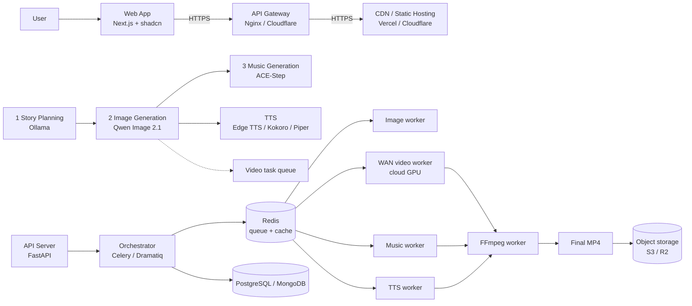

# pipemeow

Complete Technical Architecture & Implementation Guide

Local-first AI story-to-video pipeline. WAN on a cloud GPU. Continuous ready-job scheduling.

Draft for implementation. Transcribed from `pipemeow_complete_architecture.pdf`.

---

## Architecture overview

AI story-to-video pipeline: Qwen Image 2.1 + ACE-Step music + WAN video + Edge TTS + Ollama LLM.

| Color | Meaning |
|-------|---------|
| Local | Your machine |
| Cloud GPU | Rented |
| Shared | Shared services |

Solid arrows are the main flow. Dashed arrows are task and queue flow.

### 1. Client / user layer

**User**

- Create a project
- Enter a story or topic
- Choose style, voice, and music
- View progress in real time
- Download the final video

**Web app (Next.js + shadcn)**

- UI
- Project management
- Real-time progress over WebSocket
- Auth (JWT)

**API gateway (Nginx / Cloudflare)** over HTTPS

- JWT authentication
- Rate limiting
- Request routing
- WebSocket progress updates

**CDN / static hosting (Vercel / Cloudflare)** over HTTPS

- Static UI assets
- Image and video delivery
- Global CDN

### 2. Local content generation pipeline (your machine, AMD GPU)

**1. Story planning (Ollama)**

- Generate the story and split it into scenes
- Scene descriptions and prompts
- Character and location consistency
- Timeline and metadata as JSON

**2. Image generation (Qwen Image 2.1)**

- Scene images
- Character reference images
- Backgrounds and assets
- Consistency through LoRA or references
- Save to storage, with scene images and metadata

**3. Music generation (ACE-Step)**

- Background music matched to mood and duration
- Multiple variations
- Save the music file and metadata

**TTS (Edge TTS, or a local alternative)**

- Narration when needed
- Hindi and English
- Local fallback: Kokoro or Piper
- Save the voice file and timestamps

### 3. Orchestration layer (FastAPI + Celery or Dramatiq)

**API server (FastAPI)**

- Project CRUD
- Validation
- Create generation jobs
- WebSocket progress
- Result delivery

**Orchestrator / workflow manager**

- Manage stages `1 → 2 → 3 / 4 → 5 → 6`
- Create tasks and dependencies
- Push tasks to queues
- Track status and retries
- Assign cloud GPU workers for WAN
- Push progress to the client

**Redis (queue + cache)**

- Video task queue of ready jobs
- Progress cache
- Pub/sub for real-time updates

**Database (PostgreSQL or MongoDB)**

- Users, projects, and scenes
- Task status and metadata
- Generation parameters
- Logs and billing info

### 4. Task queues (Redis / Celery)

| Queue | Contents |
|-------|----------|
| Image tasks | Scene images, reference images, asset variations |
| Music tasks | Music generation, variations, moods |
| Video tasks (WAN) | Ready scene jobs from image generation: image URL, prompt, and settings. Filled continuously. Multiple stories share the queue. |
| Post-processing tasks | Combine clips and music, transitions, subtitles (STT/LLM), final render, save to storage |

**Local workers (AMD GPU)**

- Image worker (Qwen Image 2.1): pull, generate, save, update status
- Music worker (ACE-Step): pull, generate, save, update status
- TTS worker (Edge TTS or other): pull, generate narration, save, update status

**Cloud GPU workers (RunPod or another provider)**

WAN video worker (labeled WAN T2V on the diagram):

- Pull ready video jobs
- Download scene images
- Generate clips of about 5–10 seconds
- Upload clips to storage
- Update status
- Claim the next job so the GPU stays busy
- Autoscale from 1 to N workers

### 5. Post-processing (your machine, CPU / GPU)

**FFmpeg worker**

- Download WAN clips and the stage-3 music
- Add narration
- Add transitions and subtitles (STT/LLM)
- Merge and render
- Save the final video and update status

**Final output**

- Final MP4 in object storage (S3 or R2)
- Metadata and thumbnail
- Download link
- Notify the user by WebSocket or email

### 7. Storage, infrastructure, and monitoring

The diagram numbers this block 7. There is no block 6.

**Object storage (S3 / Cloudflare R2):** scene images, reference images, music, video clips, final videos, metadata, and thumbnails.

**Cloud GPU infrastructure (RunPod or another provider):** WAN model, autoscaled workers, queue consumption, uploads, and a busy GPU across multiple stories.

**Monitoring (Prometheus + Grafana):** task status, local and cloud GPU usage, queue length, error logs, performance metrics, Discord or email alerts.

**CI/CD and deployment (Docker):** containerized services, separate services, environment management.

**Optional services:** authentication (Auth0 or custom), payments and subscriptions, analytics, backup and restore, email or SMS notifications.

---

## Document map

1. Executive summary
2. Goals and design principles
3. Recommended model stack
4. End-to-end workflow
5. Dependency graph and concurrency
6. Cloud GPU utilization strategy
7. Task queues and job state
8. Suggested technology architecture
9. Data model (suggested)
10. API outline
11. Post-processing and audio rules
12. Reliability, security, and operational safety
13. Cost and performance dashboard
14. Implementation plan
15. Acceptance criteria
16. Decisions to confirm before production

---

## 1. Executive summary

pipemeow is a local-first AI story-to-video pipeline. The local machine runs story planning, image generation, music generation, optional narration, orchestration, and post-processing. WAN video generation runs only on a rented cloud GPU.

The design goal is to keep the rented GPU productive. Instead of waiting for an entire story to finish, pipemeow creates independent scene-level video jobs. A cloud worker claims the next eligible job from a shared ready queue, generates a clip, uploads it, marks it complete, and immediately claims another job.

Core dependency flow: `1 → 2 → (3 and 4 can run independently after 2) → 5 → 6`. Stage 3 does not need to finish before stage 4 starts. Both stages 3 and 4 feed stage 5.

## 2. Goals and design principles

- Keep WAN on cloud GPUs only. Do not run WAN on the local GPU.
- Run local-capable models on the local AMD GPU or CPU, subject to tested ROCm or runtime compatibility and VRAM capacity.
- Keep image generation before music generation. After image generation completes, music generation and cloud video generation can proceed independently.
- Keep the cloud GPU supplied with ready scene jobs from multiple stories where possible.
- Make every stage resumable, observable, retryable, and safe against duplicate execution.
- Store durable project and job state in a database and generated files in object storage. Use Redis for queueing and transient coordination.
- Separate model adapters from orchestration so models can be replaced without rewriting the workflow.

## 3. Recommended model stack

**Story and scene planning.** Ollama running a quantized Qwen3 Instruct model. Start by testing an 8B-class variant. Use schema-constrained JSON for scene plans, prompts, durations, and metadata.

**Image generation.** Qwen-Image-2.1. Benchmark the actual model build, resolution, quantization, and AMD runtime before setting production defaults. Save scene images, reference images, and metadata.

**Music generation.** ACE-Step, using the selected version and model variant. Generate music after image generation completes. Save audio, duration, style and mood metadata, and generation settings.

**Video generation.** WAN, such as WAN 2.2 if that is the chosen release, on rented cloud GPU workers only. Each job creates a short scene clip from an image or reference and a prompt, then uploads the result. The overview diagram labels this worker WAN T2V.

**TTS.** Start with Edge TTS if online synthesis and its service terms suit the use case. It is not a fully local model. Keep a provider interface for a local alternative such as Kokoro or Piper after validating language, voice quality, runtime, and licence.

**Post-processing.** FFmpeg for clip ordering, trims, transitions, subtitles, narration and music mixing, loudness control, and final MP4 encoding.

Model names, versions, licences, AMD/ROCm support, and commercial-use terms must be verified for the exact releases deployed. The stack above is the proposed baseline. It is not a guarantee that every version runs well on the current hardware.

## 4. End-to-end workflow

**Stage 1 — Story planning (local, Ollama).** Accept the story, lyrics, or topic, plus target duration, language, style, aspect ratio, and voice and music preferences. Produce a validated scene plan with ordered scene IDs, prompts, character references, target durations, and generation settings. Persist the plan before scheduling work.

**Stage 2 — Image generation (local, Qwen Image).** Generate scene images and character and location references. Save each artifact to object storage or configured shared storage and record its URI, checksum, model version, prompt, and status. When all required image assets for the story or scene batch are ready, mark dependent tasks eligible.

**Stage 3 — Music generation (local, ACE-Step).** This stage depends on stage 2, per the requested design. Generate a soundtrack from story mood, genre, language and context, and target duration. Save the audio and metadata. Stage 3 feeds stage 5 directly. It does not block stage 4.

**Stage 4 — Video generation (cloud GPU, WAN only).** Create one task per scene or clip. Each task references the scene image URI, prompt, WAN settings, duration, and output destination. The cloud worker claims ready tasks, downloads inputs, runs WAN, validates the output, uploads the clip, records the result, and immediately claims the next ready task. Multiple stories may share the same queue.

**Stage 5 — Post-processing (local CPU/GPU, FFmpeg).** Wait until all required stage 4 clips and the stage 3 soundtrack (and narration, if enabled) are available. Assemble clips in story order, trim and concatenate, add transitions, mix narration and music, duck music under speech, generate or align subtitles, render the final output, and validate it.

**Stage 6 — Final output.** Store the final MP4, thumbnail, subtitle file, metadata, and logs. Mark the project complete and notify the client through WebSocket, SSE, or another mechanism. Provide a download URL with access controls.

## 5. Dependency graph and concurrency

| Edge | Rule |
|------|------|
| 1 → 2 | Image generation requires the story plan. |
| 2 → 3 | Music generation starts only after the image-generation stage completes. |
| 2 → 4 | WAN jobs become ready as soon as their required scene assets and prompts exist. |
| 3 → 5 | Post-processing requires the generated soundtrack. |
| 4 → 5 | Post-processing requires the generated video clips. |
| 5 → 6 | Final output is available only after rendering and validation succeed. |

Stages 3 and 4 can run concurrently after stage 2. The scheduler should not wait for music generation to finish before submitting ready video tasks.

Recommended refinement, if allowed later: feed stage 4 scene by scene as soon as each scene asset is ready, rather than waiting for every image in a story. That maximizes cloud GPU utilization, but it changes stage 2 from a whole-stage barrier to per-scene dependencies. Keep the initial implementation on the current whole-stage rule unless that rule is explicitly changed.

## 6. Cloud GPU utilization strategy

Use a persistent WAN worker while the ready queue has work, or is expected to have work. Keep a small buffer of eligible video jobs. Start with 3–5 ready jobs as a tuning target, not a fixed requirement.

Use a global ready-video queue across projects. Order by priority, deadline, age, or a fairness policy. Preserve scene order only at final assembly, not necessarily during generation.

On completion: upload the output, validate it, mark the task complete, acknowledge the queue message, and claim the next task. Keep model weights loaded on the worker between tasks when the provider and runtime support it.

Do not run multiple WAN jobs concurrently on one GPU until memory and throughput testing proves it is safe. One active generation per GPU is the sensible initial setting.

Track queue depth, ready-job age, GPU utilization, time spent loading models, generation duration, upload duration, and idle duration. Tune the ready buffer and the local generation rate from those measurements.

If the queue is empty, no scheduler can invent useful work. Two options:

- Keep the rented instance alive and accept idle cost.
- Stop it when the backlog drains and restart it when enough work is queued.

Account for startup time, storage persistence, provider billing granularity, and worker warm-up.

## 7. Task queues and job state

Suggested queues: `image-generation`, `music-generation`, `TTS`, `video-generation-ready`, `post-processing`, and `notifications`. The WAN worker consumes only `video-generation-ready` tasks.

Suggested states: `WAITING_FOR_INPUTS`, `READY`, `RUNNING`, `UPLOADING`, `COMPLETED`, `RETRY_WAIT`, `FAILED`, `CANCELLED`.

Each task should include: `task_id`, `project_id`, `story_id`, `scene_id`, `stage`, `priority`, input artifact URIs, prompt and settings, model and version, attempt count, idempotency key, `created_at`, `started_at`, `completed_at`, output URI, error code, and worker ID.

Use leases or visibility timeouts so abandoned tasks can be recovered if a worker crashes. A worker should heartbeat while generating. Expired leases can be retried safely.

Use bounded retries with exponential backoff and a dead-letter queue for repeated failures. Do not let one bad scene block the remaining jobs.

Use idempotency keys derived from stable input and settings hashes. That avoids duplicate work and reuses cached artifacts when the prompt, reference, model version, and settings are unchanged.

## 8. Suggested technology architecture

| Layer | Choice |
|-------|--------|
| Frontend | Next.js with shadcn/ui. Projects, story settings, scene timeline, task progress, previews, logs, and download links. |
| API | FastAPI for project CRUD, validation, job creation, progress, cancellation, and signed download URLs. |
| Orchestration | Celery with Redis, or another system with retries and routing. Keep orchestration explicit and persist state in PostgreSQL. Dramatiq is a reasonable alternative. |
| Queue, cache, pub/sub | Redis for task delivery, short-lived progress and cache data, and notifications. Do not use Redis as the only durable record of task state. |
| Database | PostgreSQL for project, story, scene, and task state. MongoDB is possible. Choose one primary database. |
| Object storage | Cloudflare R2 or S3-compatible storage for scene images, references, audio, clips, final videos, thumbnails, subtitles, and manifests. |
| Realtime | WebSocket or server-sent events. Persist progress snapshots so the UI can recover after reconnecting. |
| Observability | Prometheus and Grafana, or a simpler initial metrics and logging setup. Track errors, queue latency, GPU utilization, per-model runtime, cost per minute of final video, and project completion time. |
| Deployment | Dockerize services where practical. Keep the cloud WAN worker separately deployable from the local orchestration and model services. Secure APIs, storage credentials, and worker registration. |

## 9. Data model (suggested)

**Project:** `id`, `owner_id`, `title`, `input_text`, `target_duration`, `language`, `style`, `aspect_ratio`, `status`, `created_at`, `updated_at`.

**Scene:** `id`, `project_id`, `sequence_number`, `description`, `image_prompt`, `video_prompt`, `duration_seconds`, `character_reference_ids`, `start_time`, `end_time`, `status`.

**Task:** `id`, `project_id`, `scene_id` (nullable for project-level tasks), `stage`, `state`, `priority`, `attempt_count`, `input_manifest_uri`, `output_manifest_uri`, `worker_id`, timestamps, `error_summary`, `idempotency_key`.

**Artifact:** `id`, `project_id`, `scene_id`, `task_id`, `type` (`image`, `audio`, `video`, `subtitle`, `thumbnail`, `final`), `uri`, `checksum`, `size_bytes`, `duration_seconds`, `metadata_json`, `created_at`.

**Worker:** `id`, `provider`, `gpu_type`, `state`, `current_task_id`, `last_heartbeat_at`, `runtime_version`, `reported_vram`, `started_at`.

Keep secrets, provider API keys, and signed URLs out of ordinary logs. Apply ownership checks to all project and artifact endpoints.

## 10. API outline

| Method and path | Purpose |
|-----------------|---------|
| `POST /projects` | Create a project and validate input. |
| `POST /projects/{project_id}/generate` | Start the workflow. |
| `GET /projects/{project_id}` | Fetch project status and settings. |
| `GET /projects/{project_id}/tasks` | Inspect stage and scene jobs. |
| `GET /tasks/{task_id}` | Inspect one task and its attempts. |
| `POST /tasks/{task_id}/retry` | Request a retry if allowed. |
| `POST /projects/{project_id}/cancel` | Cancel queued work and signal running workers where supported. |
| `GET /projects/{project_id}/events` or `WebSocket /ws/projects/{project_id}` | Stream progress. |
| `POST /workers/register` | Register a worker. |
| `POST /workers/{worker_id}/heartbeat` | Authenticate and monitor workers. |

Keep internal worker APIs private or authenticated. Use signed, short-lived URLs for artifact transfers.

## 11. Post-processing and audio rules

Create a project timeline from scene durations and ordering. Store explicit time bases. Do not derive the final order from task completion order.

Use FFmpeg to normalize clip dimensions, frame rate, pixel format, audio sample rate, and codecs before concatenation. Validate every output and check the FFmpeg exit status.

Keep narration timestamps and subtitle cues on a common timeline. For TTS, store text, voice and provider, language, audio URI, and duration and timing metadata.

Mix music and narration separately. Use loudness normalization and ducking under speech. Avoid clipping. Trim or loop music only with an explicit policy and fades.

Produce a render manifest listing input clip URIs, order, transition settings, audio tracks, subtitles, output profile, and the FFmpeg command and version. That makes renders reproducible.

## 12. Reliability, security, and operational safety

Use authentication and authorization for users, projects, task actions, and artifact access. Validate file type and size. Do not accept arbitrary shell commands or FFmpeg arguments from users.

Workers should fetch only authorized input artifacts and upload only to their assigned project and task paths. Use short-lived credentials or signed URLs where possible.

Persist stage transitions transactionally. Treat queue messages as at-least-once delivery and make handlers idempotent.

On restart, reconcile database task states against worker heartbeats and queue messages. Requeue tasks with expired leases and clean up orphaned temporary files.

Add resource limits, timeouts, disk-space checks, cancellation handling, and a maximum retry count. Do not mark a task complete until its output has been uploaded and validated.

Record licence, attribution, and commercial-use checks for every model, voice, and music generator used in production.

## 13. Cost and performance dashboard

Measure cloud GPU cost per completed clip and per finished video minute. Include startup, idle, generation, and shutdown time.

Track GPU idle percentage, ready-queue depth, median and p95 queue wait, median and p95 generation time, failure and retry rate, upload time, and time to final video.

Compare local image and music throughput with the arrival rate of ready WAN jobs. If the cloud queue often empties, improve local throughput, pre-generate assets when appropriate, or adjust the cloud rental policy.

If ready-queue depth grows continuously, the cloud worker is the bottleneck. Consider a faster GPU, model or runtime optimization, or additional workers after checking cost.

Estimate full-project cost before starting long jobs. Optionally enforce per-project budgets, maximum clip counts, and maximum retry spend.

## 14. Implementation plan

**Phase 1 — Baseline.** Project, scene, task, and artifact schema. Model adapters. Local Ollama planning. One small end-to-end test.

**Phase 2 — Local assets.** Qwen image generation with persisted images and manifests. ACE-Step music generation after stage 2.

**Phase 3 — Cloud WAN worker.** Provision the cloud GPU, load WAN, consume ready jobs, upload clips, report heartbeats, and claim the next job without unloading weights unnecessarily.

**Phase 4 — Post-processing.** Edge TTS or the chosen provider, FFmpeg assembly, subtitles, music mix, validation, and final artifact storage.

**Phase 5 — Reliability.** Idempotency, retries, leases, dead-letter handling, cancellation, restart recovery, and failure-injection tests.

**Phase 6 — Utilization and cost.** Multi-story global queue, worker warm-up, idle shutdown policy, GPU metrics, and a cost dashboard.

**Phase 7 — Product UI.** Live progress, scene previews, retry controls, download links, history, settings, and user-facing errors.

## 15. Acceptance criteria

- Given a valid story, the system creates a scene plan and saves its manifest.
- Image generation completes before music generation starts under the current dependency rule.
- Ready WAN tasks can start once their required scene assets exist, without waiting for music generation to finish.
- The WAN worker runs only on the cloud GPU and automatically claims the next ready job after completing a clip.
- Tasks from multiple projects can share the queue, while final assembly preserves each story's scene order.
- A worker crash or upload failure does not silently lose a task. Expired work is retried or surfaced as failed.
- Post-processing waits for the required video clips and the music and narration inputs, then creates and validates a final MP4.
- The UI shows persisted progress after refresh or reconnect. Users can access only their own projects and artifacts.
- Metrics report queue depth, worker health, failure rates, GPU idle time, and approximate cloud cost.

## 16. Decisions to confirm before production

- Exact Qwen-Image version, build, and compatible AMD runtime.
- Exact ACE-Step version and model variant, generation speed, and audio licensing.
- Exact WAN version, cloud GPU type, expected clip duration and resolution, and provider shutdown and billing behaviour.
- Whether stage 2 is a whole-story barrier, or whether WAN can start scene by scene as soon as each image is ready. The current baseline uses the whole-stage dependency.
- Whether music is generated once per story or as scene-specific segments.
- Whether narration is required for every project, and which languages and voices are required.
- Whether the task system is Redis + Celery or Redis + Dramatiq, and whether PostgreSQL is the primary database.
- Storage retention, project budgets, queue priorities, and whether the cloud worker stays warm when the queue is empty.
